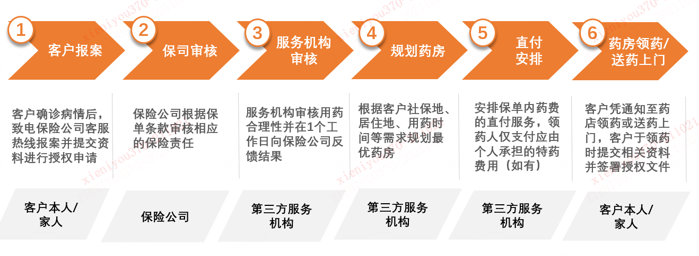
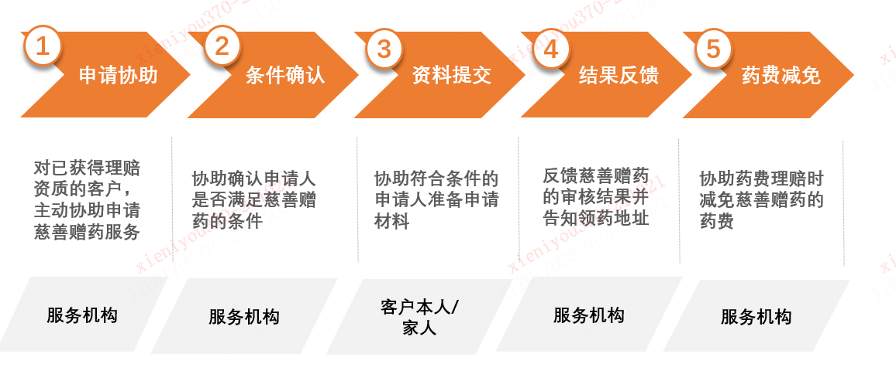
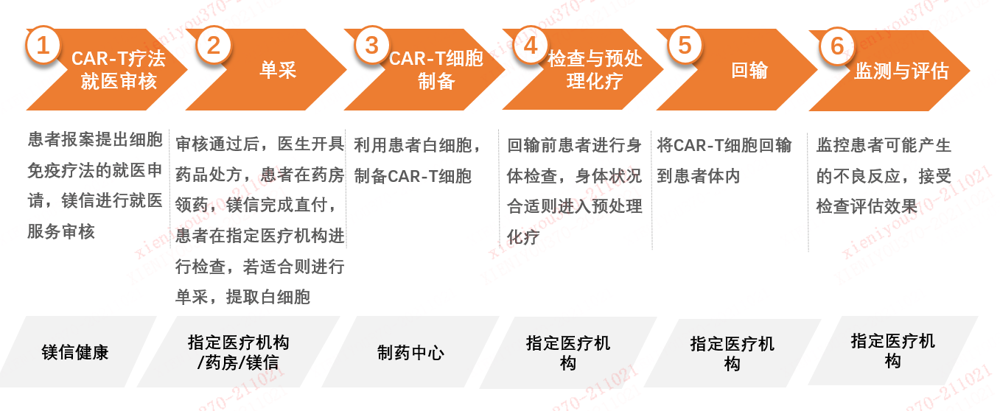

# 特药服务

本公司委托第三方服务供应商成都巴杏健康科技有限公司为被保险人提供特药服务。

1、服务简介

本公司委托第三方服务供应商成都巴杏健康科技有限公司为被保险人提供特药服务。若您有任何疑问，请拨打巴杏健康客服热线028-85359098（服务时间：周一至周日 9:00-21:00，法定节假日除外）进行咨询，我们将竭诚为您服务。

2、服务内容

客户在不幸罹患保单约定的**特定疾病**情况下，可在确诊后向本公司提出国内特定药品服务申请（国内药品授权申请）。在通过本公司保险责任审核及第三方服务公司用药合理性审核后，方可获得直付取药/送药上门服务（客户主治医生及医院需同意院外购药）。可申请的特定药品以附表《指定的特定药品清单》为准。

根据客户的需求，可为客户规划最优药房，通过短信形式向客户发放领药二维码，通知客户需携带的身份证件、处方、及相关资料，前往**合作的药店或医保定点药店**[^1] 领取特定药品。客户领药时需核销领药二维码并签署理赔申请资料及服务授权资料。对于保险合同约定范围内的药品费用**（在指定药店购买附表指定药品）**，本公司将为客户安排直付服务，客户无需支付该部分的药品费用，本公司将与第三方服务公司进行理赔费用结算。但客户需支付**不属于保险责任范围内的药品费用**，且不再向本公司申请该部分保险金。

- 服务时间：工作日9:00-17:00

- 服务频次：根据客户实际用药需求服务

- 启动条件：国内药品保单责任审核通过及用药合理性审核通过

- 配送时效：同城当日送达（上午预约，下午送达；下午预约，第二天早上送达），跨省市于预约日2-3个工作日

- 服务流程：

1.  **报案（授权申请）**：若客户（被保险人）发生保险条款中约定的疾病，应当及时向本公司报案，致电客服热线028-85359098进行授权申请，按照本保险产品合同约定备齐相关材料提出肿瘤治疗特殊药品授权申请；

2.  **审核流程**：在资料齐全后，本公司进行保单责任的审核和认定，通过后委托巴杏健康联系客户，并于1个工作日内完成用药合理性审核。用药合理性审核为对需要购买的特药是否符合对当前治疗是医疗必需且合理的，是否符合国家药品监督管理部门批准的药品说明书中所列明的适应症和用法用量而进行的审核。审核均通过后，客户可获得特定药品直付服务，巴杏健康将联系客户确定领药方式和地点；

3.  **规划药房**：客户可选择领药方式（药店领药/送药上门）, 巴杏健康服务人员根据客户需求（居住地、医保所在地、意向领药地）规划药房，发送领药二维码，指引客户携带本人身份证件、处方、领药二维码及相关资料，前往合作的药店或医保定点药店或告知详细的药品签收地址和签收时间；

4.  **直付安排**：客户需配合填写相应授权纸质材料，于药店领药时或者送药上门时提交，经药店核对无误，巴杏健康将安排直付结算，客户无需支付保单责任内的药费，巴杏健康会向药店收取药品发票并协助药费的理赔手续（药店不再向个人提供药品发票）；客户需承担保险责任外应其个人承担的特定药品费用的部分（如有），个人支付部分发票需经本公司理赔后可申请后寄回。

5.  **领药**：客户须在须在药品处方审核通过后的十五日内携带药品处方原件、领药凭证、本人的有效身份证件及社保卡（若有）等至本公司合作的药店或医保定点药店出示二维码进行核销和领药（若委托他人代领的，还需提供授权委托书和委托人的身份证明）。若客户选择送药上门服务，巴杏健康将通过特药药房网络提供送药上门服务，客户在签收时需提供药品处方原件、领药凭证、本人的有效身份证件，并核销领药二维码。

**药品质量的把控**：药厂直供确保药品正规渠道来源，严格管理采购渠道，药品均可在药监局网站查验。

**配送质量的把控**:药房员工或签约的快递公司可进行全国范围配送业务，若配送过程中出现丢失、损坏或其他原因导致的问题，由服务机构承担并及时进行补发处理。

**巴杏健康客服热线**：028-85359098（服务时间：周一至周日 9:00-21:00）将提供专业药师免费咨询服务，相关的免费咨询服务包括：药品咨询服务（药品常规说明、用药禁忌、药品适应症相关等）、预约购药药店咨询（药店查询导航、最优购药路径规划）、新特药咨询服务（提供新特药相关疾病资讯，新特药慈善赠药项目咨询）。

**特药服务所需资料**（具体以服务人员告知为准）：

a)申请用药服务时的理赔申请书原件（需被保险人签字和日期）；

b)被保险人的有效身份证件正反面复印件（如被保险人为未成年人，需额外提供监护人身份证明复印件、与被保险人的监护关系证明复印件）；

c）医院出具的门急诊和住院病历、诊断证明、出院小结、药品处方、与诊断证明相关的病历显微镜检查、血液检验及其它科学方法检验报告及其它所需要的医学材料；

d）领药确认书（需被保险人领药时签字和日期）；

e）保险金代领取授权书（需被保险人领药时签字和日期）；

f） 若领药委托他人的，还应提供委托书及委托人和受托人的身份证明等相关证明文件；

**药品费直付比例**：保险合同保障范围内的恶性肿瘤—重度特定药品费用包括社保目录内药品费用及社保目录外药品费用，以药品处方开具时药品属于社保目录内或社保目录外为准。若您结算**社保目录外**药品费用，**则约定的给付比例均为100%**；若您结算**社保目录内**药品费用，则按照**以下约定的给付比例**给付恶性肿瘤—重度特定药品费用医疗保险金：

|  |  |
|:--:|:--:|
| **给付条件** | **给付比例** |
| 如果被保险人以有社会医疗保险身份投保，且已从社会医疗保险获得该次医疗费用补偿 | 100% |
| **如果被保险人以有社会医疗保险身份投保，但未从社会医疗保险获得该次医疗费用补偿** | **60%** |
| 如果被保险人以无社会医疗保险身份投保 | 100% |

**【特别说明】**

1)  药品直付服务仅限已开通直付功能的指定药店；若客户通过了用药合理性评价，因不可控因素导致指定的药房无法提供需要的药品或无法进行医保实时结算服务，客户可选择在本公司认可的其它医院/药店自行购药。客户须先付款购药，可在购药后向本公司平安财产保险股份有限公司上海分公司提交并邮寄相关纸质理赔材料申请理赔，若因用药合理性等原因无法得到理赔的，本公司会在审核后书面通知客户。

2)  药品配送服务仅限已开通配送功能的指定药店；注射剂特定药品涉及的冷链运输保价及配送费用需由客户个人承担。

3)  若申请的药品属于医保内药品需要医保实时结算的，巴杏健康服务人员会引导客户去就近的大病医保药房刷医保卡结算并领药。送药上门服务只限于无需医保实时结算的药品。

4)  每次预约购药的药品剂量不应超过一个月，因此肿瘤药品授权申请仅针对首次用药申请，二次及以后的用药无需再次进行授权申请，但是仍需进行药品处方审核，客户可直接向巴杏健康提交药品处方审核申请，若提交的材料不足，请配合巴杏健康补充相关材料，后续流程与首次用药一致；

5)  若药品处方未通过审核，客户可在接受未通过审核结果时，获得选择一次门诊绿通再次确认的机会。巴杏健康将向客户赠送此次专家门诊绿通服务，并在5个工作日内安排客户前往绿通服务医院进行就诊。巴杏健康只承担绿通产生的号源协调服务费，就诊过程中产生的挂号费用、诊疗费用、交通食宿费用需由客户自行承担。若新的治疗方案用药在本公司指定的药品清单内，则客户可参照上述流程重新提交药品处方审核申请。

3、国内上市特定药品慈善赠药申请服务（PAP）

本公司委托巴杏健康服务公司，协助客户申请领取特种药品慈善赠药服务，最大程度帮助客户用药开支，避免超额理赔。

- 启动条件：成功申领第一次特药之后

- 服务时效：符合慈善援助用药条件，1个工作日内联系客户

- 领药时效：根据慈善机构申请要求

- 服务频次：根据您实际用药需求服务

- 服务流程：

1.   若客户领取的特种药品提供慈善赠药服务，巴杏健康会在客户首次领药完毕后告知保司客户慈善赠药的申请条件；

2.  当客户用药情况符合慈善赠药项目申请条件时（具体以各慈善机构公布的药品援助条件为准），巴杏健康将在1个工作日内联系客户，进行慈善赠药项目的申请；

3.  巴杏健康指导客户准备线下申请材料，包括个人信息、医学材料及经济材料等。同时协助客户在基金会的线上平台提交申请，客户在收到基金会线上审核通过的结果后，巴杏健康将按慈善赠药项目规定时间提前提醒并协助客户将纸质申请材料邮寄给基金会；

4.  慈善赠药项目审核通过后，客户须携带规定的领药材料到慈善赠药项目的指定药店领取赠药，且赠药不占用保单特种药品费保险金的额度。援助用药项目审核通过后，客户未到援助用药项目的指定药店领取援助用药，则视为放弃本次援助用药权益；

5.  若客户未通过慈善赠药项目审核或者符合慈善赠药但是不愿意申请慈善项目，仍可正常申请特药服务。

**【特别说明】**：

1)  **援助用药申请指导服务仅限中国大陆公民使用**，同时仅限客户被保险人本人使用，不可转让给他人；若客户未通过援助用药项目审核，则客户须按照保险条款约定重新提交直付或理赔申请并需进行药品用药合理性审核。

2)  本公司指定的慈善机构指依法成立、符合《中华人民共和国慈善法》规定，以面向社会开展慈善活动为宗旨的非营利性组织机构。慈善机构可以采取基金会、社会团体、社会服务机构等组织形式。

4、特定CAR-T疗法直付服务

CAR-T疗法（又称嵌合抗原受体T细胞治疗），是指将T细胞经过基因工程手段体外修饰改造后，回输患者体内使T细胞行使特异的杀伤功能的疗法。本公司委托巴杏健康为持有保单的被保险人提供特定CAR-T疗法的药品费用直付服务。

- 服务申请条件：

1\. 等待期后被保险人被专科医生确诊初次患保险合同所定义的特定重大疾病，且所需使用的特定Car-T疗法属于保险合同约定的药品清单；通过保险主合同约定的细胞免疫疗法就医资格评估，经指定医疗机构评估认为适合接受细胞免疫疗法的情形；

2\. 需提供由卫生行政部门认定的二级以上（含二级）公立医院出具的病历、必需的病理检验、血液检验及其他科学诊断报告以及由专科医生出具的诊断书、手术证明和处方。

- 服务时效：抽血至回输：20~30个自然日左右

- 服务流程：

①　CAR-T疗法就医审核：您在我司报案后，如果符合保单责任范围，本公司将委托巴杏健康对CAR-T疗法就医合理性进行审核。在审核通过且获得本公司确认，巴杏健康将安排后续服务。

②　单采：审核通过后，您经指定医疗机构评估确认适合使用指定药品进行细胞免疫疗法并由该医疗机构医生开具药品处方。巴杏健康为您规划药房，并指导您在指定药房签署用药协议。用药协议签署后，由巴杏健康完成细胞免疫疗法费用直付（视为药品已派发，巴杏健康可后续收集资料代为理赔）。您需在指定医疗机构接受单采相关的各项检查，确保您的身体状况适合单采。若适合，则提取白细胞。

③　CAR-T细胞制备：利用您的白细胞，在制药中心制备CAR-T细胞。

④　检查与预处理化疗：您在指定医疗机构接受CAR-T细胞回输相关的各项检查，确保您的身体状况适合进行预处理化疗和回输。若您身体状况合适，您在指定医疗机构接受CAR-T细胞回输前的预处理化疗。

⑤　回输：在指定医疗机构将CAR-T细胞回输到您体内。

⑥　监控与评估：指定医疗机构监护您，控制CAR-T治疗可能带来的不良反应，并且您需要接受各项检查，以此来评估治疗效果。

**【特别说明】**：

1)  在接受CAR-T疗法治疗后，有可能会出现不同程度的不良反应。如果出现不良反应，请告知医护人员，有资质的医护人员将遵循指导原则为您提供帮助。在某些情况下，不良反应可能会自行消失，无需额外治疗。可能出现的不良反应包括：发烧（≥38℃）、心跳快速、低血压、白细胞降低、血小板减少、意识模糊、说话困难或说话含糊不清、恶心、腹泻。

2)  输注后，为监测细胞因子释放综合征和神经系统毒性症状和体征，您需要在医疗机构至少连续监测10天。

3)  在接受CAR-T治疗后的至少4周内，您应在接受治疗或在经资质确认的医疗机构附近居住（2小时内地抵达）。

4)  在CAR-T治疗后的初始阶段（8周内），建议患者不要开车和从事危险的职业或活动。

5)  当您就医时，请务必告诉医护人员接受过CAR-T治疗，同时请出示CAR-T患者提示卡，以便医护人员综合评估与制定医疗方案。

6)  基于用药协议载明的药品费用，巴杏健康将根据保险合同约定的赔付比例为您提供药品费用垫付服务。

7)  客户签署用药协议，巴杏健康完成垫付操作，视为药品已派发，巴杏健康后续将收集相关资料代为理赔。

5、特药服务声明与注意事项

1)  服务使用条件：保险期间内，您在**保险单载明的等待期满之日后**（续保者自续保生效后）经附加保险合同本附加保险合同中约定的医院或指定医院的专科医生**初次确诊**罹患附加保险合同本附加保险合同约定的**特定疾病**（无论一种或多种），对于治疗该疾病发生的**必需且合理**的特定药品费用，**本公司按照保险单载明赔付比例承担境内上市特定药品费用保险责任。**

2)  特定疾病：指“恶性肿瘤——重度”、“ 恶性肿瘤——轻度”及原位癌。

3)  **恶性肿瘤—重度**指恶性细胞不受控制的进行性增长和扩散，浸润和破坏周围正常组织，可以经血管、淋巴管和体腔扩散转移到身体其他部位，病灶经组织病理学检查（涵盖骨髓病理学检查）结果明确诊断，临床诊断属于世界卫生组织（WHO，World Health Organization）《疾病和有关健康问题的国际统计分类》第十次修订版（ICD-10）的恶性肿瘤类别及《国际疾病分类肿瘤学专辑》第三版（ICD-O-3）的肿瘤形态学编码属于3、6、9（恶性肿瘤）范畴的疾病。具体释义详见特种药品保险产品的保险条款。

4)  【恶性肿瘤——轻度】指恶性细胞不受控制的进行性增长和扩散，浸润和破坏周围正常组织，可以经血管、淋巴管和体腔扩散转移到身体其他部位，病灶经组织病理学检查（涵盖骨髓病理学检查）结果明确诊断，临床诊断属于世界卫生组织（WHO，World Health Organization）《疾病和有关健康问题的国际统计分类》第十次修订版（ICD-10）的恶性肿瘤类别及《国际疾病分类肿瘤学专辑》第三版（ICD-O-3）的肿瘤形态学编码属于3、6、9（恶性肿瘤）范畴的疾病。

5)  在享受服务时会收集您的个人信息，您的个人信息和生成的健康报告将严格保密，我们保证不会将您的个人信息披露给与服务提供无关的第三方。

6)  本服务不可转让给他人。

7)  如被保险人为未成年人或无民事行为能力人，本服务申请可由其法定监护人代其申请；

8)  由于您提供不真实、不准确、不完整、不及时或不能反映当前情况的相关资料，而导致本服务发生缺失偏差或延误，相应责任将由您自行承担。

9)  对于本公司合理控制范围以外的各种原因， 包括但不限于自然灾害、罢工或骚乱、物质短缺或定量配给、暴动、战争行为、政府行为、通讯或其他设施故障或严重伤亡事故等，致使本公司延迟或未能履行本服务的，本公司不负任何责任。

6、服务注意事项

1）保险合同相关的各项服务**仅限被保险人本人使用（除家庭医生外），不可转让给他人；**

2）如被保险人为未成年人或无民事行为能力人，本服务申请可由其法定监护人代其申请；

3）本服务手册中介绍上述线下就医服务**单个保单年度内住院垫付不限次数(保险责任赔付额度范围内),重疾绿通仅限一次，安心陪诊仅限一次，住院护工三次，特药服务不限次；**

4）住院垫付、重疾绿通、安心陪诊、住院护工完成预约后，**因客户原因放弃或取消服务的，视同该次服务已完成；**

5）**若涉及未如实告知（被保险人存在不符合投保条件或者欺诈情形的）、责任免除事项、在等待期内出险（因意外伤害发生保险责任的，无等待期）等情况，将不能享受本服务。**

6）线下就医服务中，本公司仅提供住院安排服务的协调沟通，不干涉医院内治疗、诊断等相关医疗行为，医疗服务请遵守医院规定。

7、其他注意事项

1）特药服务由本公司授权供应商为您提供，若您与供应商因服务而产生的任何纠纷，本公司会尽力协调您与供应商依据相关法律法规解决纠纷。

2）在提供本服务时，**如本公司查明正在申请或享受本服务者并非您本人，本公司有权立即拒绝提供本服务并保留追偿的权利。**

3）本公司尊重并保护您的隐私权，未经您许可本公司不会将任何与您相关的信息泄露给无关的第三方。为了更好的为您提供服务，本公司及授权供应商可能会就您申请的服务向您询问姓名、性别、电话号码、地址、社保情况等信息，您有权决定是否提供相关信息**，但本公司不承担由信息不全导致的损失。**

4）**由于您提供不真实、不准确、不完整、不及时或不能反映当前情况的相关资料，而导致本服务发生缺失偏差或延误，相应责任将由您自行承担。**

5）**对于本公司合理控制范围以外的各种原因，包括但不限于自然灾害、罢工或骚乱、物质短缺或定量配给、暴动、战争行为、政府行为、通讯或其他设施故障或严重伤亡事故等，致使本公司延迟或未能履行本服务的，本公司不负任何责任。**

8、常见问题

**1. 通常有哪些情况特药处方申请审核不通过？**

A: 基于客户的健康，通常在有下列情况时，特药处方审核不会通过：

（一）药品处方的开具与国家药品监督管理局批准的药品说明书中所列明的适应症及用法用量不一致；

（二）使用处方中的药品已有一段时间，确定对该药品已经耐药，包括以下两种情况之一：

（1）实体肿瘤病灶按照RECIST（实体瘤治疗疗效评价标准）出现疾病进展；

（2）非实体肿瘤（包括白血病、多发性骨髓瘤、骨髓纤维化、淋巴瘤等血液系统恶性肿瘤）在临床上常无明确的肿块或肿块较小难以发现，经规范治疗后，按相关专业机构的指南规范，对客户骨髓形态学、流式细胞、特定基因检测等结果进行综合评价，得出疾病进展的结论。

**2.药品处方审核不通过时，为什么安排门诊绿通？**

A: 特定药品处方审核不通过，在客户已经认可不通过的审核结果的同时，可根据客户的意愿，由巴杏健康协助免费安排一次门诊绿通增值服务，安排专科医生为客户进行一次二诊服务。通过二诊的再次诊疗，可制定新的且适合客户目前疾病状态的治疗方案。若新的治疗方案用药在指定的药品清单内，则可重新申请药品处方审核及服务。我们赠送客户此次门诊绿通的费用，但其他相关医疗费用，如门诊挂号费、检查费等均需客户自理。

**3.指定的药房能覆盖到我所在的城市吗？**

A: 本公司指定的合作药房覆盖了30个省份，253个城市，并且支持通过送药上门的方式进行药品配送，满足中国大陆地区的药品供应。

**4.若我自行在你们公司认可的医院付费购药，是否可以享受特种药品服务？药费是否能够理赔？**

A: 若客户已按预约用药流程提出授权申请，审核通过后，可以享有特种药品服务。若客户未通过审核自行去医院购药是不可以享受特种药品服务的，药费也无法理赔。

**5.特定C-ART疗法适用疾病类型包括哪些**

A：适用疾病类型指特定Car-T疗法已在中国内地获批的适应症所对应的疾病种类，具体以国家药品监督管理局批准的药品说明书为准。

附件1：特定药品清单

<table style="width:96%;">
<colgroup>
<col style="width: 10%" />
<col style="width: 10%" />
<col style="width: 18%" />
<col style="width: 11%" />
<col style="width: 45%" />
</colgroup>
<tbody>
<tr>
<td style="text-align: center;">序号</td>
<td style="text-align: center;">商品名</td>
<td style="text-align: center;">成分词</td>
<td style="text-align: center;">厂商</td>
<td style="text-align: center;">适用癌症种类</td>
</tr>
<tr>
<td style="text-align: center;">1</td>
<td style="text-align: center;">可瑞达</td>
<td style="text-align: center;">帕博利珠单抗注射液</td>
<td style="text-align: center;">默沙东</td>
<td style="text-align: center;">黑色素瘤、肺癌、食管癌、头颈部鳞状细胞癌、结直肠癌、肝癌、胆道癌、乳腺癌、实体瘤、胃癌、胃食管结合部癌、宫颈癌、尿路上皮癌、子宫内膜癌</td>
</tr>
<tr>
<td style="text-align: center;">2</td>
<td style="text-align: center;">欧狄沃</td>
<td style="text-align: center;">纳武利尤单抗注射液</td>
<td style="text-align: center;">百时美施贵宝</td>
<td style="text-align: center;">肺癌、恶性胸膜间皮瘤、头颈部鳞状细胞癌、尿路上皮癌、食管癌、胃或胃食管连接部癌或食管腺癌、结直肠癌、肝细胞癌</td>
</tr>
<tr>
<td style="text-align: center;">3</td>
<td style="text-align: center;">乐卫玛</td>
<td style="text-align: center;">甲磺酸仑伐替尼胶囊</td>
<td style="text-align: center;">卫材</td>
<td style="text-align: center;">肝癌、甲状腺癌</td>
</tr>
<tr>
<td style="text-align: center;">4</td>
<td style="text-align: center;">爱博新</td>
<td style="text-align: center;">哌柏西利胶囊</td>
<td style="text-align: center;">辉瑞</td>
<td style="text-align: center;">乳腺癌</td>
</tr>
<tr>
<td style="text-align: center;">5</td>
<td style="text-align: center;">拓益</td>
<td style="text-align: center;">特瑞普利单抗注射液</td>
<td style="text-align: center;">君实生物</td>
<td style="text-align: center;">肺癌、鼻咽癌、食管癌、黑色素瘤、尿路上皮癌、肾癌、乳腺癌、肝癌</td>
</tr>
<tr>
<td style="text-align: center;">6</td>
<td style="text-align: center;">多泽润</td>
<td style="text-align: center;">达可替尼片</td>
<td style="text-align: center;">辉瑞</td>
<td style="text-align: center;">肺癌</td>
</tr>
<tr>
<td style="text-align: center;">7</td>
<td style="text-align: center;">艾瑞卡</td>
<td style="text-align: center;">注射用卡瑞利珠单抗</td>
<td style="text-align: center;">恒瑞</td>
<td style="text-align: center;">肺癌、肝癌、食管癌、鼻咽癌、淋巴瘤</td>
</tr>
<tr>
<td style="text-align: center;">8</td>
<td style="text-align: center;">兆珂</td>
<td style="text-align: center;">达雷妥尤单抗注射液</td>
<td style="text-align: center;">杨森</td>
<td style="text-align: center;">多发性骨髓瘤</td>
</tr>
<tr>
<td style="text-align: center;">9</td>
<td style="text-align: center;">安森珂</td>
<td style="text-align: center;">阿帕他胺片</td>
<td style="text-align: center;">杨森</td>
<td style="text-align: center;">前列腺癌</td>
</tr>
<tr>
<td style="text-align: center;">10</td>
<td style="text-align: center;">安圣莎</td>
<td style="text-align: center;">盐酸阿来替尼胶囊</td>
<td style="text-align: center;">罗氏</td>
<td style="text-align: center;">肺癌</td>
</tr>
<tr>
<td style="text-align: center;">11</td>
<td style="text-align: center;">利普卓</td>
<td style="text-align: center;">奥拉帕利片</td>
<td style="text-align: center;">阿斯利康</td>
<td style="text-align: center;">上皮性卵巢癌、输卵管癌、原发性腹膜癌、前列腺癌、乳腺癌</td>
</tr>
<tr>
<td style="text-align: center;">12</td>
<td style="text-align: center;">捷恪卫</td>
<td style="text-align: center;">磷酸芦可替尼片</td>
<td style="text-align: center;">诺华</td>
<td style="text-align: center;">骨髓纤维化、移植物抗宿主病</td>
</tr>
<tr>
<td style="text-align: center;">13</td>
<td style="text-align: center;">艾瑞妮</td>
<td style="text-align: center;">马来酸吡咯替尼片</td>
<td style="text-align: center;">恒瑞</td>
<td style="text-align: center;">乳腺癌</td>
</tr>
<tr>
<td style="text-align: center;">14</td>
<td style="text-align: center;">帕捷特</td>
<td style="text-align: center;">帕妥珠单抗注射液</td>
<td style="text-align: center;">罗氏</td>
<td style="text-align: center;">乳腺癌</td>
</tr>
<tr>
<td style="text-align: center;">15</td>
<td style="text-align: center;">爱优特</td>
<td style="text-align: center;">呋喹替尼胶囊</td>
<td style="text-align: center;">和黄</td>
<td style="text-align: center;">结直肠癌、子宫内膜癌</td>
</tr>
<tr>
<td style="text-align: center;">16</td>
<td style="text-align: center;">达伯舒</td>
<td style="text-align: center;">信迪利单抗注射液</td>
<td style="text-align: center;">信达生物</td>
<td style="text-align: center;">肺癌、肝癌、胃癌、食管癌、淋巴瘤</td>
</tr>
<tr>
<td style="text-align: center;">17</td>
<td style="text-align: center;">亿珂</td>
<td style="text-align: center;">伊布替尼胶囊</td>
<td style="text-align: center;">杨森</td>
<td style="text-align: center;">华氏巨球蛋白血症、白血病、淋巴瘤</td>
</tr>
<tr>
<td style="text-align: center;">18</td>
<td style="text-align: center;">佐博伏</td>
<td style="text-align: center;">维莫非尼片</td>
<td style="text-align: center;">罗氏</td>
<td style="text-align: center;">黑色素瘤</td>
</tr>
<tr>
<td style="text-align: center;">19</td>
<td style="text-align: center;">万珂</td>
<td style="text-align: center;">注射用硼替佐米</td>
<td style="text-align: center;">杨森</td>
<td style="text-align: center;">多发性骨髓瘤、淋巴瘤</td>
</tr>
<tr>
<td style="text-align: center;">20</td>
<td style="text-align: center;">昕泰</td>
<td style="text-align: center;">注射用硼替佐米</td>
<td style="text-align: center;">江苏豪森</td>
<td style="text-align: center;">多发性骨髓瘤、淋巴瘤</td>
</tr>
<tr>
<td style="text-align: center;">21</td>
<td style="text-align: center;">千平</td>
<td style="text-align: center;">注射用硼替佐米</td>
<td style="text-align: center;">正大天晴</td>
<td style="text-align: center;">多发性骨髓瘤、淋巴瘤</td>
</tr>
<tr>
<td style="text-align: center;">22</td>
<td style="text-align: center;">齐普乐</td>
<td style="text-align: center;">注射用硼替佐米</td>
<td style="text-align: center;">齐鲁制药</td>
<td style="text-align: center;">多发性骨髓瘤、淋巴瘤</td>
</tr>
<tr>
<td style="text-align: center;">23</td>
<td style="text-align: center;">益久</td>
<td style="text-align: center;">注射用硼替佐米</td>
<td style="text-align: center;">正大天晴</td>
<td style="text-align: center;">多发性骨髓瘤、淋巴瘤</td>
</tr>
<tr>
<td style="text-align: center;">24</td>
<td style="text-align: center;">恩立施</td>
<td style="text-align: center;">注射用硼替佐米</td>
<td style="text-align: center;">先声东元</td>
<td style="text-align: center;">多发性骨髓瘤、淋巴瘤</td>
</tr>
<tr>
<td style="text-align: center;">25</td>
<td style="text-align: center;">百汇泽</td>
<td style="text-align: center;">帕米帕利胶囊</td>
<td style="text-align: center;">百济神州</td>
<td style="text-align: center;">卵巢癌、输卵管癌、原发性腹膜癌</td>
</tr>
<tr>
<td style="text-align: center;">26</td>
<td style="text-align: center;">泰吉华</td>
<td style="text-align: center;">阿伐替尼片</td>
<td style="text-align: center;">基石</td>
<td style="text-align: center;">胃肠道间质瘤</td>
</tr>
<tr>
<td style="text-align: center;">27</td>
<td style="text-align: center;">擎乐</td>
<td style="text-align: center;">瑞派替尼片</td>
<td style="text-align: center;">再鼎医药</td>
<td style="text-align: center;">胃肠道间质瘤</td>
</tr>
<tr>
<td style="text-align: center;">28</td>
<td style="text-align: center;">普吉华</td>
<td style="text-align: center;">普拉替尼胶囊</td>
<td style="text-align: center;">基石</td>
<td style="text-align: center;">肺癌、甲状腺癌</td>
</tr>
<tr>
<td style="text-align: center;">29</td>
<td style="text-align: center;">诺倍戈</td>
<td style="text-align: center;">达罗他胺片</td>
<td style="text-align: center;">拜耳</td>
<td style="text-align: center;">前列腺癌</td>
</tr>
<tr>
<td style="text-align: center;">30</td>
<td style="text-align: center;">适加坦</td>
<td style="text-align: center;">富马酸吉瑞替尼片</td>
<td style="text-align: center;">安斯泰来</td>
<td style="text-align: center;">白血病</td>
</tr>
<tr>
<td style="text-align: center;">31</td>
<td style="text-align: center;">艾弗沙</td>
<td style="text-align: center;">甲磺酸伏美替尼片</td>
<td style="text-align: center;">艾力斯</td>
<td style="text-align: center;">肺癌</td>
</tr>
<tr>
<td style="text-align: center;">32</td>
<td style="text-align: center;">逸沃</td>
<td style="text-align: center;">伊匹木单抗注射液</td>
<td style="text-align: center;">百时美施贵宝</td>
<td style="text-align: center;">胸膜间皮瘤、结直肠癌、肺癌、肝癌</td>
</tr>
<tr>
<td style="text-align: center;">33</td>
<td style="text-align: center;">泽普生</td>
<td style="text-align: center;">甲苯磺酸多纳非尼片</td>
<td style="text-align: center;">泽璟制药</td>
<td style="text-align: center;">甲状腺癌、肝癌</td>
</tr>
<tr>
<td style="text-align: center;">34</td>
<td style="text-align: center;">爱地希</td>
<td style="text-align: center;">注射用纬迪西妥单抗</td>
<td style="text-align: center;">荣昌生物</td>
<td style="text-align: center;">尿路上皮癌、胃癌、胃食管结合部腺癌</td>
</tr>
<tr>
<td style="text-align: center;">35</td>
<td style="text-align: center;">佳罗华</td>
<td style="text-align: center;">奥妥珠单抗注射液</td>
<td style="text-align: center;">罗氏</td>
<td style="text-align: center;">淋巴瘤</td>
</tr>
<tr>
<td style="text-align: center;">36</td>
<td style="text-align: center;">多菲戈</td>
<td style="text-align: center;">氯化镭 [223Ra] 注射液</td>
<td style="text-align: center;">拜耳</td>
<td style="text-align: center;">前列腺癌</td>
</tr>
<tr>
<td style="text-align: center;">37</td>
<td style="text-align: center;">安维汀</td>
<td style="text-align: center;">贝伐珠单抗注射液</td>
<td style="text-align: center;">罗氏</td>
<td style="text-align: center;">肺癌、肝癌、上皮性卵巢癌、输卵管癌或原发性腹膜癌、宫颈癌、脑瘤、结直肠癌</td>
</tr>
<tr>
<td style="text-align: center;">38</td>
<td style="text-align: center;">达攸同</td>
<td style="text-align: center;">贝伐珠单抗注射液</td>
<td style="text-align: center;">信达生物</td>
<td style="text-align: center;">肺癌、肝癌、脑瘤、结直肠癌、卵巢癌、输卵管癌或原发性腹膜癌、宫颈癌</td>
</tr>
<tr>
<td style="text-align: center;">39</td>
<td style="text-align: center;">安可达</td>
<td style="text-align: center;">贝伐珠单抗注射液</td>
<td style="text-align: center;">齐鲁制药</td>
<td style="text-align: center;">脑瘤、结直肠癌、肺癌、肝癌</td>
</tr>
<tr>
<td style="text-align: center;">40</td>
<td style="text-align: center;">格列卫</td>
<td style="text-align: center;">甲磺酸伊马替尼片/甲磺酸伊马替尼胶囊</td>
<td style="text-align: center;">诺华</td>
<td style="text-align: center;">白血病、骨髓增生异常综合症、肥大细胞增生症、皮肤纤维肉瘤、胃肠道间质瘤</td>
</tr>
<tr>
<td style="text-align: center;">41</td>
<td style="text-align: center;">诺利宁</td>
<td style="text-align: center;">甲磺酸伊马替尼片/甲磺酸伊马替尼胶囊</td>
<td style="text-align: center;">石药</td>
<td style="text-align: center;">白血病、骨髓增生异常综合症、肥大细胞增生症、皮肤纤维肉瘤、胃肠道间质瘤</td>
</tr>
<tr>
<td style="text-align: center;">42</td>
<td style="text-align: center;">格尼可</td>
<td style="text-align: center;">甲磺酸伊马替尼片/甲磺酸伊马替尼胶囊</td>
<td style="text-align: center;">正大天晴</td>
<td style="text-align: center;">白血病、骨髓增生异常综合症、肥大细胞增生症、皮肤纤维肉瘤、胃肠道间质瘤</td>
</tr>
<tr>
<td style="text-align: center;">43</td>
<td style="text-align: center;">昕维</td>
<td style="text-align: center;">甲磺酸伊马替尼片/甲磺酸伊马替尼胶囊</td>
<td style="text-align: center;">江苏豪森</td>
<td style="text-align: center;">白血病、骨髓增生异常综合症、肥大细胞增生症、皮肤纤维肉瘤、胃肠道间质瘤</td>
</tr>
<tr>
<td style="text-align: center;">44</td>
<td style="text-align: center;">瑞复美</td>
<td style="text-align: center;">来那度胺胶囊</td>
<td style="text-align: center;">百济神州</td>
<td style="text-align: center;">淋巴瘤、多发性骨髓瘤</td>
</tr>
<tr>
<td style="text-align: center;">45</td>
<td style="text-align: center;">立生</td>
<td style="text-align: center;">来那度胺胶囊</td>
<td style="text-align: center;">双鹭药业</td>
<td style="text-align: center;">多发性骨髓瘤</td>
</tr>
<tr>
<td style="text-align: center;">46</td>
<td style="text-align: center;">安显</td>
<td style="text-align: center;">来那度胺胶囊</td>
<td style="text-align: center;">正大天晴</td>
<td style="text-align: center;">淋巴瘤、多发性骨髓瘤</td>
</tr>
<tr>
<td style="text-align: center;">47</td>
<td style="text-align: center;">齐普怡</td>
<td style="text-align: center;">来那度胺胶囊</td>
<td style="text-align: center;">齐鲁制药</td>
<td style="text-align: center;">多发性骨髓瘤</td>
</tr>
<tr>
<td style="text-align: center;">48</td>
<td style="text-align: center;">佑甲</td>
<td style="text-align: center;">来那度胺胶囊</td>
<td style="text-align: center;">扬子江</td>
<td style="text-align: center;">多发性骨髓瘤</td>
</tr>
<tr>
<td style="text-align: center;">49</td>
<td style="text-align: center;">多吉美</td>
<td style="text-align: center;">甲苯磺酸索拉非尼片</td>
<td style="text-align: center;">拜耳</td>
<td style="text-align: center;">肝癌，肾癌、甲状腺癌</td>
</tr>
<tr>
<td style="text-align: center;">50</td>
<td style="text-align: center;">利格思泰</td>
<td style="text-align: center;">甲苯磺酸索拉非尼片</td>
<td style="text-align: center;">青峰医药</td>
<td style="text-align: center;">甲状腺癌、肝癌、肾癌</td>
</tr>
<tr>
<td style="text-align: center;">51</td>
<td style="text-align: center;">爱必妥</td>
<td style="text-align: center;">西妥昔单抗注射液</td>
<td style="text-align: center;">默克</td>
<td style="text-align: center;">结直肠癌、头颈部鳞状癌</td>
</tr>
<tr>
<td style="text-align: center;">52</td>
<td style="text-align: center;">维全特</td>
<td style="text-align: center;">培唑帕尼片</td>
<td style="text-align: center;">诺华</td>
<td style="text-align: center;">肾癌</td>
</tr>
<tr>
<td style="text-align: center;">53</td>
<td style="text-align: center;">赞可达</td>
<td style="text-align: center;">塞瑞替尼胶囊</td>
<td style="text-align: center;">诺华</td>
<td style="text-align: center;">肺癌</td>
</tr>
<tr>
<td style="text-align: center;">54</td>
<td style="text-align: center;">泽珂</td>
<td style="text-align: center;">醋酸阿比特龙片</td>
<td style="text-align: center;">杨森</td>
<td style="text-align: center;">前列腺癌</td>
</tr>
<tr>
<td style="text-align: center;">55</td>
<td style="text-align: center;">艾森特</td>
<td style="text-align: center;">醋酸阿比特龙片</td>
<td style="text-align: center;">恒瑞</td>
<td style="text-align: center;">前列腺癌</td>
</tr>
<tr>
<td style="text-align: center;">56</td>
<td style="text-align: center;">晴可舒</td>
<td style="text-align: center;">醋酸阿比特龙片</td>
<td style="text-align: center;">正大天晴</td>
<td style="text-align: center;">前列腺癌</td>
</tr>
<tr>
<td style="text-align: center;">57</td>
<td style="text-align: center;">欣杨</td>
<td style="text-align: center;">醋酸阿比特龙片</td>
<td style="text-align: center;">青峰医药</td>
<td style="text-align: center;">前列腺癌</td>
</tr>
<tr>
<td style="text-align: center;">58</td>
<td style="text-align: center;">卓容</td>
<td style="text-align: center;">醋酸阿比特龙片</td>
<td style="text-align: center;">齐鲁制药</td>
<td style="text-align: center;">前列腺癌</td>
</tr>
<tr>
<td style="text-align: center;">59</td>
<td style="text-align: center;">拜万戈</td>
<td style="text-align: center;">瑞戈非尼片</td>
<td style="text-align: center;">拜耳</td>
<td style="text-align: center;">结直肠癌、胃肠道间质瘤、肝癌</td>
</tr>
<tr>
<td style="text-align: center;">60</td>
<td style="text-align: center;">赛可瑞</td>
<td style="text-align: center;">克唑替尼胶囊</td>
<td style="text-align: center;">辉瑞</td>
<td style="text-align: center;">肺癌</td>
</tr>
<tr>
<td style="text-align: center;">61</td>
<td style="text-align: center;">泰瑞沙</td>
<td style="text-align: center;">甲磺酸奥希替尼片</td>
<td style="text-align: center;">阿斯利康</td>
<td style="text-align: center;">肺癌</td>
</tr>
<tr>
<td style="text-align: center;">62</td>
<td style="text-align: center;">恩莱瑞</td>
<td style="text-align: center;">枸橼酸伊沙佐米胶囊</td>
<td style="text-align: center;">武田</td>
<td style="text-align: center;">多发性骨髓瘤</td>
</tr>
<tr>
<td style="text-align: center;">63</td>
<td style="text-align: center;">泰欣生</td>
<td style="text-align: center;">尼妥珠单抗注射液</td>
<td style="text-align: center;">百泰生物</td>
<td style="text-align: center;">胰腺癌、鼻咽癌、头颈部鳞癌</td>
</tr>
<tr>
<td style="text-align: center;">64</td>
<td style="text-align: center;">恩度</td>
<td style="text-align: center;">重组人血管内皮抑制素注射液</td>
<td style="text-align: center;">山东先声麦得津</td>
<td style="text-align: center;">肺癌</td>
</tr>
<tr>
<td style="text-align: center;">65</td>
<td style="text-align: center;">英立达</td>
<td style="text-align: center;">阿昔替尼片</td>
<td style="text-align: center;">辉瑞</td>
<td style="text-align: center;">肾癌</td>
</tr>
<tr>
<td style="text-align: center;">66</td>
<td style="text-align: center;">索坦</td>
<td style="text-align: center;">苹果酸舒尼替尼胶囊</td>
<td style="text-align: center;">辉瑞</td>
<td style="text-align: center;">肾癌、胃肠间质瘤、神经内分泌瘤</td>
</tr>
<tr>
<td style="text-align: center;">67</td>
<td style="text-align: center;">诺力平</td>
<td style="text-align: center;">苹果酸舒尼替尼胶囊</td>
<td style="text-align: center;">石药</td>
<td style="text-align: center;">神经内分泌瘤、肾癌、胃肠道间质瘤</td>
</tr>
<tr>
<td style="text-align: center;">68</td>
<td style="text-align: center;">升福达</td>
<td style="text-align: center;">苹果酸舒尼替尼胶囊</td>
<td style="text-align: center;">江苏豪森</td>
<td style="text-align: center;">肾癌、胃肠道间质瘤、神经内分泌瘤</td>
</tr>
<tr>
<td style="text-align: center;">69</td>
<td style="text-align: center;">艾坦</td>
<td style="text-align: center;">甲磺酸阿帕替尼片</td>
<td style="text-align: center;">恒瑞</td>
<td style="text-align: center;">肝癌、胃腺癌、胃-食管结合部腺癌</td>
</tr>
<tr>
<td style="text-align: center;">70</td>
<td style="text-align: center;">施达赛</td>
<td style="text-align: center;">达沙替尼片</td>
<td style="text-align: center;">百时美施贵宝</td>
<td style="text-align: center;">白血病</td>
</tr>
<tr>
<td style="text-align: center;">71</td>
<td style="text-align: center;">依尼舒</td>
<td style="text-align: center;">达沙替尼片</td>
<td style="text-align: center;">正大天晴</td>
<td style="text-align: center;">白血病</td>
</tr>
<tr>
<td style="text-align: center;">72</td>
<td style="text-align: center;">达希纳</td>
<td style="text-align: center;">尼洛替尼胶囊</td>
<td style="text-align: center;">诺华</td>
<td style="text-align: center;">白血病</td>
</tr>
<tr>
<td style="text-align: center;">73</td>
<td style="text-align: center;">美罗华</td>
<td style="text-align: center;">利妥昔单抗注射液</td>
<td style="text-align: center;">罗氏</td>
<td style="text-align: center;">白血病、淋巴瘤</td>
</tr>
<tr>
<td style="text-align: center;">74</td>
<td style="text-align: center;">汉利康</td>
<td style="text-align: center;">利妥昔单抗注射液</td>
<td style="text-align: center;">上海复宏汉霖</td>
<td style="text-align: center;">白血病、淋巴瘤</td>
</tr>
<tr>
<td style="text-align: center;">75</td>
<td style="text-align: center;">达伯华</td>
<td style="text-align: center;">利妥昔单抗注射液</td>
<td style="text-align: center;">信达生物</td>
<td style="text-align: center;">白血病、淋巴瘤</td>
</tr>
<tr>
<td style="text-align: center;">76</td>
<td style="text-align: center;">赫双妥</td>
<td style="text-align: center;">帕妥珠曲妥珠单抗注射液（皮下注射）</td>
<td style="text-align: center;">罗氏</td>
<td style="text-align: center;">乳腺癌</td>
</tr>
<tr>
<td style="text-align: center;">77</td>
<td style="text-align: center;">爱谱沙</td>
<td style="text-align: center;">西达本胺片</td>
<td style="text-align: center;">微芯生物</td>
<td style="text-align: center;">淋巴瘤、乳腺癌</td>
</tr>
<tr>
<td style="text-align: center;">78</td>
<td style="text-align: center;">吉泰瑞</td>
<td style="text-align: center;">马来酸阿法替尼片</td>
<td style="text-align: center;">勃林格殷格翰</td>
<td style="text-align: center;">肺癌</td>
</tr>
<tr>
<td style="text-align: center;">79</td>
<td style="text-align: center;">赫赛汀</td>
<td style="text-align: center;">注射用曲妥珠单抗</td>
<td style="text-align: center;">罗氏</td>
<td style="text-align: center;">乳腺癌、胃癌</td>
</tr>
<tr>
<td style="text-align: center;">80</td>
<td style="text-align: center;">汉曲优</td>
<td style="text-align: center;">注射用曲妥珠单抗</td>
<td style="text-align: center;">复宏汉霖</td>
<td style="text-align: center;">乳腺癌、胃腺癌或胃食管交界腺癌</td>
</tr>
<tr>
<td style="text-align: center;">81</td>
<td style="text-align: center;">福可维</td>
<td style="text-align: center;">盐酸安罗替尼胶囊</td>
<td style="text-align: center;">正大天晴</td>
<td style="text-align: center;">肺癌、甲状腺癌、软组织肉瘤、子宫内膜癌、肾细胞癌、肝癌</td>
</tr>
<tr>
<td style="text-align: center;">82</td>
<td style="text-align: center;">飞尼妥</td>
<td style="text-align: center;">依维莫司片</td>
<td style="text-align: center;">诺华</td>
<td style="text-align: center;">乳腺癌、肾癌、神经内分泌瘤、肾血管平滑肌脂肪瘤、脑瘤</td>
</tr>
<tr>
<td style="text-align: center;">83</td>
<td style="text-align: center;">易瑞沙</td>
<td style="text-align: center;">吉非替尼片</td>
<td style="text-align: center;">阿斯利康</td>
<td style="text-align: center;">肺癌</td>
</tr>
<tr>
<td style="text-align: center;">84</td>
<td style="text-align: center;">伊瑞可</td>
<td style="text-align: center;">吉非替尼片</td>
<td style="text-align: center;">齐鲁制药</td>
<td style="text-align: center;">肺癌</td>
</tr>
<tr>
<td style="text-align: center;">85</td>
<td style="text-align: center;">吉至</td>
<td style="text-align: center;">吉非替尼片</td>
<td style="text-align: center;">正大天晴</td>
<td style="text-align: center;">肺癌</td>
</tr>
<tr>
<td style="text-align: center;">86</td>
<td style="text-align: center;">科愈新</td>
<td style="text-align: center;">吉非替尼片</td>
<td style="text-align: center;">科伦药业</td>
<td style="text-align: center;">肺癌</td>
</tr>
<tr>
<td style="text-align: center;">87</td>
<td style="text-align: center;">艾兴康</td>
<td style="text-align: center;">吉非替尼片</td>
<td style="text-align: center;">恒瑞</td>
<td style="text-align: center;">肺癌</td>
</tr>
<tr>
<td style="text-align: center;">88</td>
<td style="text-align: center;">吉苏</td>
<td style="text-align: center;">吉非替尼片</td>
<td style="text-align: center;">扬子江</td>
<td style="text-align: center;">肺癌</td>
</tr>
<tr>
<td style="text-align: center;">89</td>
<td style="text-align: center;">凯美纳</td>
<td style="text-align: center;">盐酸埃克替尼片</td>
<td style="text-align: center;">贝达药业</td>
<td style="text-align: center;">肺癌</td>
</tr>
<tr>
<td style="text-align: center;">90</td>
<td style="text-align: center;">特罗凯</td>
<td style="text-align: center;">盐酸厄洛替尼片</td>
<td style="text-align: center;">罗氏</td>
<td style="text-align: center;">肺癌</td>
</tr>
<tr>
<td style="text-align: center;">91</td>
<td style="text-align: center;">洛瑞特</td>
<td style="text-align: center;">盐酸厄洛替尼片</td>
<td style="text-align: center;">石药</td>
<td style="text-align: center;">肺癌</td>
</tr>
<tr>
<td style="text-align: center;">92</td>
<td style="text-align: center;">豪森昕福</td>
<td style="text-align: center;">甲磺酸氟马替尼片</td>
<td style="text-align: center;">江苏豪森</td>
<td style="text-align: center;">白血病</td>
</tr>
<tr>
<td style="text-align: center;">93</td>
<td style="text-align: center;">安可坦</td>
<td style="text-align: center;">恩扎卢胺软胶囊</td>
<td style="text-align: center;">安斯泰来</td>
<td style="text-align: center;">前列腺癌</td>
</tr>
<tr>
<td style="text-align: center;">94</td>
<td style="text-align: center;">誉妥</td>
<td style="text-align: center;">赛帕利单抗注射液</td>
<td style="text-align: center;">誉衡药业</td>
<td style="text-align: center;">淋巴瘤、宫颈癌</td>
</tr>
<tr>
<td style="text-align: center;">95</td>
<td style="text-align: center;">安尼可</td>
<td style="text-align: center;">派安普利单抗注射液</td>
<td style="text-align: center;">正大天晴康方</td>
<td style="text-align: center;">肺癌、淋巴瘤、鼻咽癌</td>
</tr>
<tr>
<td style="text-align: center;">96</td>
<td style="text-align: center;">泰菲乐</td>
<td style="text-align: center;">甲磺酸达拉非尼胶囊</td>
<td style="text-align: center;">诺华</td>
<td style="text-align: center;">肺癌、黑色素瘤</td>
</tr>
<tr>
<td style="text-align: center;">97</td>
<td style="text-align: center;">迈吉宁</td>
<td style="text-align: center;">曲美替尼片</td>
<td style="text-align: center;">诺华</td>
<td style="text-align: center;">黑色素瘤、肺癌</td>
</tr>
<tr>
<td style="text-align: center;">98</td>
<td style="text-align: center;">英飞凡</td>
<td style="text-align: center;">度伐利尤单抗注射液</td>
<td style="text-align: center;">阿斯利康</td>
<td style="text-align: center;">肺癌、胆道癌、子宫内膜癌</td>
</tr>
<tr>
<td style="text-align: center;">99</td>
<td style="text-align: center;">则乐</td>
<td style="text-align: center;">甲苯磺酸尼拉帕利胶囊</td>
<td style="text-align: center;">再鼎医药</td>
<td style="text-align: center;">卵巢癌、输卵管癌、原发性腹膜癌</td>
</tr>
<tr>
<td style="text-align: center;">100</td>
<td style="text-align: center;">百泽安</td>
<td style="text-align: center;">替雷利珠单抗注射液</td>
<td style="text-align: center;">百济神州</td>
<td style="text-align: center;">肺癌、实体瘤、食管癌、鼻咽癌、肝癌、淋巴瘤、尿路上皮癌、胃或胃食管结合部腺癌</td>
</tr>
<tr>
<td style="text-align: center;">101</td>
<td style="text-align: center;">赫赛莱</td>
<td style="text-align: center;">注射用恩美曲妥珠单抗</td>
<td style="text-align: center;">罗氏</td>
<td style="text-align: center;">乳腺癌</td>
</tr>
<tr>
<td style="text-align: center;">102</td>
<td style="text-align: center;">泰圣奇</td>
<td style="text-align: center;">阿替利珠单抗注射液</td>
<td style="text-align: center;">罗氏</td>
<td style="text-align: center;">肺癌、肝癌</td>
</tr>
<tr>
<td style="text-align: center;">103</td>
<td style="text-align: center;">阿美乐</td>
<td style="text-align: center;">甲磺酸阿美替尼片</td>
<td style="text-align: center;">江苏豪森</td>
<td style="text-align: center;">肺癌</td>
</tr>
<tr>
<td style="text-align: center;">104</td>
<td style="text-align: center;">贺俪安</td>
<td style="text-align: center;">马来酸奈拉替尼片</td>
<td style="text-align: center;">皮尔法伯制药</td>
<td style="text-align: center;">乳腺癌</td>
</tr>
<tr>
<td style="text-align: center;">105</td>
<td style="text-align: center;">安适利</td>
<td style="text-align: center;">注射用维布妥昔单抗</td>
<td style="text-align: center;">武田</td>
<td style="text-align: center;">淋巴瘤</td>
</tr>
<tr>
<td style="text-align: center;">106</td>
<td style="text-align: center;">百悦泽</td>
<td style="text-align: center;">泽布替尼胶囊</td>
<td style="text-align: center;">百济神州</td>
<td style="text-align: center;">华氏巨球蛋白血症、白血病、淋巴瘤</td>
</tr>
<tr>
<td style="text-align: center;">107</td>
<td style="text-align: center;">赛普汀</td>
<td style="text-align: center;">注射用伊尼妥单抗</td>
<td style="text-align: center;">三生国健</td>
<td style="text-align: center;">乳腺癌</td>
</tr>
<tr>
<td style="text-align: center;">108</td>
<td style="text-align: center;">凯洛斯</td>
<td style="text-align: center;">注射用卡非佐米</td>
<td style="text-align: center;">百济神州</td>
<td style="text-align: center;">多发性骨髓瘤</td>
</tr>
<tr>
<td style="text-align: center;">109</td>
<td style="text-align: center;">倍利妥</td>
<td style="text-align: center;">注射用贝林妥欧单抗</td>
<td style="text-align: center;">百济神州</td>
<td style="text-align: center;">白血病</td>
</tr>
<tr>
<td style="text-align: center;">110</td>
<td style="text-align: center;">宜诺凯</td>
<td style="text-align: center;">奥布替尼片</td>
<td style="text-align: center;">诺诚健华</td>
<td style="text-align: center;">淋巴瘤、白血病</td>
</tr>
<tr>
<td style="text-align: center;">111</td>
<td style="text-align: center;">唯可来</td>
<td style="text-align: center;">维奈克拉片</td>
<td style="text-align: center;">艾伯维</td>
<td style="text-align: center;">白血病</td>
</tr>
<tr>
<td style="text-align: center;">112</td>
<td style="text-align: center;">贝美纳</td>
<td style="text-align: center;">盐酸恩沙替尼胶囊</td>
<td style="text-align: center;">贝达药业</td>
<td style="text-align: center;">肺癌</td>
</tr>
<tr>
<td style="text-align: center;">113</td>
<td style="text-align: center;">安跃</td>
<td style="text-align: center;">泊马度胺胶囊</td>
<td style="text-align: center;">正大天晴</td>
<td style="text-align: center;">多发性骨髓瘤</td>
</tr>
<tr>
<td style="text-align: center;">114</td>
<td style="text-align: center;">富洛特</td>
<td style="text-align: center;">普拉曲沙注射液</td>
<td style="text-align: center;">萌蒂制药</td>
<td style="text-align: center;">淋巴瘤</td>
</tr>
<tr>
<td style="text-align: center;">115</td>
<td style="text-align: center;">艾瑞颐</td>
<td style="text-align: center;">氟唑帕利胶囊</td>
<td style="text-align: center;">恒瑞</td>
<td style="text-align: center;">卵巢癌、输卵管癌、原发性腹膜癌、上皮性卵巢癌</td>
</tr>
<tr>
<td style="text-align: center;">116</td>
<td style="text-align: center;">唯择</td>
<td style="text-align: center;">阿贝西利片</td>
<td style="text-align: center;">礼来</td>
<td style="text-align: center;">乳腺癌</td>
</tr>
<tr>
<td style="text-align: center;">117</td>
<td style="text-align: center;">苏泰达</td>
<td style="text-align: center;">索凡替尼胶囊</td>
<td style="text-align: center;">和记黄埔</td>
<td style="text-align: center;">神经内分泌瘤</td>
</tr>
<tr>
<td style="text-align: center;">118</td>
<td style="text-align: center;">沃瑞沙</td>
<td style="text-align: center;">赛沃替尼片</td>
<td style="text-align: center;">和记黄埔</td>
<td style="text-align: center;">肺癌</td>
</tr>
<tr>
<td style="text-align: center;">119</td>
<td style="text-align: center;">奕凯达</td>
<td style="text-align: center;">阿基仑赛注射液</td>
<td style="text-align: center;">复星凯特</td>
<td style="text-align: left;">本品为经基因修饰的靶向人 CD19 的嵌合抗原受体自体 T (CAR-T) 细胞，用于治疗: 
1、一线免疫化疗无效或在一线免疫化疗后 12 个月内复发的成人大 B 细胞淋巴瘤 (r/r LBCL)。 
2、既往接受二线或以上系统性治疗后复发或难治性大 B 细胞淋巴瘤成人患者，包括弥漫性大B细胞淋巴瘤(DLBCL)非特指型(NOS)，原发纵隔大B细胞淋巴瘤 (PMBCL)、高级别B细胞淋巴瘤和滤泡性淋巴瘤转化的DLBCL。</td>
</tr>
<tr>
<td style="text-align: center;">120</td>
<td style="text-align: center;">倍诺达</td>
<td style="text-align: center;">瑞基仑赛注射液</td>
<td style="text-align: center;">药明巨诺</td>
<td style="text-align: left;">1、经过二线或以上系统性治疗后成人患者的复发或难治性大B细胞淋巴瘤，包括弥漫性大B细胞淋巴瘤非特指型、滤泡性淋巴瘤转化的弥漫性大B细胞淋巴瘤、3b级滤泡性淋巴瘤、原发纵隔大B细胞淋巴瘤、高级别B细胞淋巴瘤伴MYC和BCL-2和/或BCL-6重排(双打击/三打击淋巴瘤)。 
2、经过二线或以上系统性治疗的成人难治性或24个月内复发的滤泡性淋巴瘤，包括组织学分级为1、2、3a级的滤泡性淋巴瘤。 
3.经过包括布鲁顿酪氨酸激酶抑制剂治疗在内的二线及以上系统性治疗的成人复发或难治性套细胞淋巴瘤。</td>
</tr>
</tbody>
</table>

附件2：合作药店示例清单

<table style="width:76%;">
<colgroup>
<col style="width: 10%" />
<col style="width: 14%" />
<col style="width: 10%" />
<col style="width: 40%" />
</colgroup>
<tbody>
<tr>
<td style="text-align: center;"><strong>省份</strong></td>
<td style="text-align: center;"><strong>城市</strong></td>
<td style="text-align: center;"><strong>药房数量</strong></td>
<td style="text-align: center;"><strong>DTP示例药房</strong></td>
</tr>
<tr>
<td rowspan="13" style="text-align: center;">安徽省</td>
<td style="text-align: center;">安庆市</td>
<td style="text-align: center;">2</td>
<td style="text-align: center;">安庆华氏大药房有限公司宜城分店</td>
</tr>
<tr>
<td style="text-align: center;">蚌埠市</td>
<td style="text-align: center;">2</td>
<td style="text-align: center;">安徽天星大药房连锁有限公司蚌埠市春和义大药房</td>
</tr>
<tr>
<td style="text-align: center;">滁州市</td>
<td style="text-align: center;">3</td>
<td style="text-align: center;">天长市天康药房有限公司</td>
</tr>
<tr>
<td style="text-align: center;">阜阳市</td>
<td style="text-align: center;">2</td>
<td style="text-align: center;">阜阳市第一大药房零售连锁有限公司颍泉区人民路一店</td>
</tr>
<tr>
<td rowspan="2" style="text-align: center;">合肥市</td>
<td rowspan="2" style="text-align: center;">15</td>
<td style="text-align: center;">安徽天星大药房连锁有限公司新特药药房</td>
</tr>
<tr>
<td style="text-align: center;">合肥新稀特大药房有限公司</td>
</tr>
<tr>
<td style="text-align: center;">淮北市</td>
<td style="text-align: center;">3</td>
<td style="text-align: center;">安徽高济敬贤堂药业有限责任公司医药大厦壹佰零柒店</td>
</tr>
<tr>
<td style="text-align: center;">黄山市</td>
<td style="text-align: center;">2</td>
<td style="text-align: center;">黄山市一心伯特利大药房有限公司</td>
</tr>
<tr>
<td style="text-align: center;">芜湖市</td>
<td style="text-align: center;">3</td>
<td style="text-align: center;">芜湖徽弋堂大药房有限公司</td>
</tr>
<tr>
<td style="text-align: center;">宿州市</td>
<td style="text-align: center;">1</td>
<td style="text-align: center;">安徽天星大药房连锁有限公司宿州分公司</td>
</tr>
<tr>
<td style="text-align: center;">铜陵市</td>
<td style="text-align: center;">1</td>
<td style="text-align: center;">国药控股铜陵有限公司笔架山路药房</td>
</tr>
<tr>
<td style="text-align: center;">宣城市</td>
<td style="text-align: center;">1</td>
<td style="text-align: center;">宣城市德宣堂大药房有限公司</td>
</tr>
<tr>
<td style="text-align: center;">池州市</td>
<td style="text-align: center;">1</td>
<td style="text-align: center;">铜陵江南大药房连锁有限公司贵池秋浦西路店</td>
</tr>
<tr>
<td rowspan="6" style="text-align: center;">北京市</td>
<td rowspan="6" style="text-align: center;">北京市</td>
<td rowspan="6" style="text-align: center;">23</td>
<td style="text-align: center;">北京德信行医保全新大药房有限公司安定门店</td>
</tr>
<tr>
<td style="text-align: center;">北京恩济普惠大药房有限公司</td>
</tr>
<tr>
<td style="text-align: center;">北京国大药房连锁有限公司永定门连锁店</td>
</tr>
<tr>
<td style="text-align: center;">北京金象大药房医药连锁有限责任公司西单金象大药房</td>
</tr>
<tr>
<td style="text-align: center;">北京市亿顺堂医药有限公司</td>
</tr>
<tr>
<td style="text-align: center;">北京信海科园大药房有限公司</td>
</tr>
<tr>
<td rowspan="11" style="text-align: center;">福建省</td>
<td rowspan="2" style="text-align: center;">福州市</td>
<td rowspan="2" style="text-align: center;">14</td>
<td style="text-align: center;">国药控股福州有限公司鼓楼区古田路国控大药房</td>
</tr>
<tr>
<td style="text-align: center;">国药控股福州专业药房有限公司鼓楼区古田路分店</td>
</tr>
<tr>
<td style="text-align: center;">龙岩市</td>
<td style="text-align: center;">2</td>
<td style="text-align: center;">国药控股龙岩有限公司新罗区九一北路药店</td>
</tr>
<tr>
<td style="text-align: center;">南平市</td>
<td style="text-align: center;">2</td>
<td style="text-align: center;">国药控股南平新力量有限公司南平四鹤店</td>
</tr>
<tr>
<td style="text-align: center;">宁德市</td>
<td style="text-align: center;">1</td>
<td style="text-align: center;">国药控股宁德有限公司福安鹤兴店</td>
</tr>
<tr>
<td style="text-align: center;">莆田市</td>
<td style="text-align: center;">1</td>
<td style="text-align: center;">国药控股莆田有限公司荔城延寿店</td>
</tr>
<tr>
<td style="text-align: center;">泉州市</td>
<td style="text-align: center;">6</td>
<td style="text-align: center;">国药控股泉州有限公司丰泽东海店</td>
</tr>
<tr>
<td style="text-align: center;">三明市</td>
<td style="text-align: center;">1</td>
<td style="text-align: center;">国药控股三明有限公司直营药房</td>
</tr>
<tr>
<td rowspan="2" style="text-align: center;">厦门市</td>
<td rowspan="2" style="text-align: center;">12</td>
<td style="text-align: center;">鹭燕医药股份有限公司湖里门市部</td>
</tr>
<tr>
<td style="text-align: center;">厦门鹭燕大药房有限公司镇海路分店</td>
</tr>
<tr>
<td style="text-align: center;">漳州市</td>
<td style="text-align: center;">1</td>
<td style="text-align: center;">国药控股漳州有限公司芗城胜利西路药店</td>
</tr>
<tr>
<td rowspan="5" style="text-align: center;">甘肃省</td>
<td style="text-align: center;">定西市</td>
<td style="text-align: center;">1</td>
<td style="text-align: center;">重庆医药（集团）甘肃欣特医药连锁有限公司定西店</td>
</tr>
<tr>
<td rowspan="2" style="text-align: center;">兰州市</td>
<td rowspan="2" style="text-align: center;">10</td>
<td style="text-align: center;">兰州惠仁堂药业连锁有限责任公司新特药房</td>
</tr>
<tr>
<td style="text-align: center;">重庆医药（集团）甘肃欣特医药连锁有限公司肿瘤医院店</td>
</tr>
<tr>
<td style="text-align: center;">武威市</td>
<td style="text-align: center;">1</td>
<td style="text-align: center;">重庆医药（集团）甘肃欣特医药连锁有限公司武威店</td>
</tr>
<tr>
<td style="text-align: center;">天水市</td>
<td style="text-align: center;">1</td>
<td style="text-align: center;">重庆医药（集团）甘肃欣特医药连锁有限公司天水店</td>
</tr>
<tr>
<td rowspan="33" style="text-align: center;">广东省</td>
<td style="text-align: center;">东莞市</td>
<td style="text-align: center;">9</td>
<td style="text-align: center;">国药控股广州有限公司东莞大药房</td>
</tr>
<tr>
<td rowspan="2" style="text-align: center;">佛山市</td>
<td rowspan="2" style="text-align: center;">14</td>
<td style="text-align: center;">国药控股广州有限公司佛山大药房</td>
</tr>
<tr>
<td style="text-align: center;">广州医药大药房有限公司佛山亲仁路分店</td>
</tr>
<tr>
<td rowspan="6" style="text-align: center;">广州市</td>
<td rowspan="6" style="text-align: center;">48</td>
<td style="text-align: center;">广东德信行大药房连锁有限公司旗舰店</td>
</tr>
<tr>
<td style="text-align: center;">广州市南外大药房有限公司</td>
</tr>
<tr>
<td style="text-align: center;">广州医药大药房有限公司海珠区南洲店</td>
</tr>
<tr>
<td style="text-align: center;">广州百济新特药业连锁有限公司肿瘤药品分店</td>
</tr>
<tr>
<td style="text-align: center;">国药控股大药房广州连锁有限公司站前店</td>
</tr>
<tr>
<td style="text-align: center;">国药控股广州有限公司大药房</td>
</tr>
<tr>
<td style="text-align: center;">惠州市</td>
<td style="text-align: center;">11</td>
<td style="text-align: center;">国药控股广州有限公司惠州大药房鹅岭北路分店</td>
</tr>
<tr>
<td style="text-align: center;">江门市</td>
<td style="text-align: center;">5</td>
<td style="text-align: center;">国药控股广州有限公司江门大药房</td>
</tr>
<tr>
<td style="text-align: center;">揭阳市</td>
<td style="text-align: center;">3</td>
<td style="text-align: center;">国药控股广州有限公司揭阳临江南路大药房</td>
</tr>
<tr>
<td style="text-align: center;">梅州市</td>
<td style="text-align: center;">2</td>
<td style="text-align: center;">国药控股广州有限公司梅州大药房</td>
</tr>
<tr>
<td style="text-align: center;">清远市</td>
<td style="text-align: center;">1</td>
<td style="text-align: center;">国药控股广州有限公司清远大药房</td>
</tr>
<tr>
<td style="text-align: center;">汕头市</td>
<td style="text-align: center;">4</td>
<td style="text-align: center;">国药控股广州有限公司汕头大药房</td>
</tr>
<tr>
<td style="text-align: center;">汕尾市</td>
<td style="text-align: center;">1</td>
<td style="text-align: center;">国药控股广州有限公司陆丰人医大药房</td>
</tr>
<tr>
<td style="text-align: center;">韶关市</td>
<td style="text-align: center;">2</td>
<td style="text-align: center;">国药控股广州有限公司韶关大药房</td>
</tr>
<tr>
<td rowspan="5" style="text-align: center;">深圳市</td>
<td rowspan="5" style="text-align: center;">34</td>
<td style="text-align: center;">国药控股国大药房（深圳）连锁有限公司展销厅分店</td>
</tr>
<tr>
<td style="text-align: center;">国药控股国大药房（深圳）连锁有限公司莲花北分店</td>
</tr>
<tr>
<td style="text-align: center;">国药控股国大药房（深圳）连锁有限公司振兴分店</td>
</tr>
<tr>
<td style="text-align: center;">深圳广药联康医药有限公司翠竹药房</td>
</tr>
<tr>
<td style="text-align: center;">国药控股深圳延风有限公司新稀特大药房</td>
</tr>
<tr>
<td style="text-align: center;">湛江市</td>
<td style="text-align: center;">7</td>
<td style="text-align: center;">国药控股广州有限公司湛江大药房</td>
</tr>
<tr>
<td style="text-align: center;">肇庆市</td>
<td style="text-align: center;">4</td>
<td style="text-align: center;">国药控股广州有限公司肇庆大药房</td>
</tr>
<tr>
<td style="text-align: center;">中山市</td>
<td style="text-align: center;">5</td>
<td style="text-align: center;">国药控股广州有限公司中山大药房</td>
</tr>
<tr>
<td rowspan="2" style="text-align: center;">珠海市</td>
<td rowspan="2" style="text-align: center;">3</td>
<td style="text-align: center;">国药控股广州有限公司珠海大药房</td>
</tr>
<tr>
<td style="text-align: center;">珠海市凤凰园发展有限公司</td>
</tr>
<tr>
<td style="text-align: center;">河源市</td>
<td style="text-align: center;">1</td>
<td style="text-align: center;">国药控股广州有限公司河源文祥路大药房</td>
</tr>
<tr>
<td rowspan="2" style="text-align: center;">茂名市</td>
<td rowspan="2" style="text-align: center;">4</td>
<td style="text-align: center;">广州医药大药房有限公司高州中心店</td>
</tr>
<tr>
<td style="text-align: center;">广州医药大药房有限公司茂名中心店</td>
</tr>
<tr>
<td rowspan="2" style="text-align: center;">云浮市</td>
<td rowspan="2" style="text-align: center;">2</td>
<td style="text-align: center;">国药控股广州有限公司罗定药房</td>
</tr>
<tr>
<td style="text-align: center;">国药控股广州有限公司云浮大药房</td>
</tr>
<tr>
<td style="text-align: center;">潮州市</td>
<td style="text-align: center;">2</td>
<td style="text-align: center;">广州医药大药房有限公司潮州中心店</td>
</tr>
<tr>
<td rowspan="14" style="text-align: center;">广西壮族自治区</td>
<td style="text-align: center;">百色市</td>
<td style="text-align: center;">1</td>
<td style="text-align: center;">柳州桂中大药房连锁有限责任公司百色中山店</td>
</tr>
<tr>
<td style="text-align: center;">北海市</td>
<td style="text-align: center;">2</td>
<td style="text-align: center;">柳州桂中大药房连锁有限责任公司北海解放路分店</td>
</tr>
<tr>
<td style="text-align: center;">崇左市</td>
<td style="text-align: center;">1</td>
<td style="text-align: center;">国药控股广西有限公司崇左龙峡山中路大药房</td>
</tr>
<tr>
<td style="text-align: center;">贵港市</td>
<td style="text-align: center;">3</td>
<td style="text-align: center;">柳州桂中大药房连锁有限责任公司贵港中山中路店</td>
</tr>
<tr>
<td style="text-align: center;">桂林市</td>
<td style="text-align: center;">4</td>
<td style="text-align: center;">国药控股广西有限公司桂林大药房</td>
</tr>
<tr>
<td style="text-align: center;">河池市</td>
<td style="text-align: center;">2</td>
<td style="text-align: center;">柳州桂中大药房连锁有限责任公司宜州山谷路店</td>
</tr>
<tr>
<td style="text-align: center;">贺州市</td>
<td style="text-align: center;">4</td>
<td style="text-align: center;">国药控股广西有限公司贺州育才路大药房</td>
</tr>
<tr>
<td style="text-align: center;">柳州市</td>
<td style="text-align: center;">2</td>
<td style="text-align: center;">柳州桂中大药房连锁有限责任公司北站路药店</td>
</tr>
<tr>
<td rowspan="3" style="text-align: center;">南宁市</td>
<td rowspan="3" style="text-align: center;">13</td>
<td style="text-align: center;">国药控股广西有限公司南宁桃源路大药房</td>
</tr>
<tr>
<td style="text-align: center;">柳州桂中大药房连锁有限责任公司南宁教育路药店</td>
</tr>
<tr>
<td style="text-align: center;">广西医大大药房连锁有限责任公司一附院便民店</td>
</tr>
<tr>
<td style="text-align: center;">钦州市</td>
<td style="text-align: center;">5</td>
<td style="text-align: center;">柳州桂中大药房连锁有限责任公司钦州明阳路店</td>
</tr>
<tr>
<td style="text-align: center;">梧州市</td>
<td style="text-align: center;">4</td>
<td style="text-align: center;">柳州桂中大药房连锁有限责任公司梧州潘塘店</td>
</tr>
<tr>
<td style="text-align: center;">玉林市</td>
<td style="text-align: center;">1</td>
<td style="text-align: center;">国药控股广西有限公司玉林大药房</td>
</tr>
<tr>
<td rowspan="5" style="text-align: center;">贵州省</td>
<td rowspan="3" style="text-align: center;">贵阳市</td>
<td rowspan="3" style="text-align: center;">7</td>
<td style="text-align: center;">贵州省医药（集团）和平药房连锁有限公司贵阳延安中路分店</td>
</tr>
<tr>
<td style="text-align: center;">贵州一树连锁药业有限公司地矿分店</td>
</tr>
<tr>
<td style="text-align: center;">国药控股贵州有限公司云岩分店</td>
</tr>
<tr>
<td style="text-align: center;">遵义市</td>
<td style="text-align: center;">3</td>
<td style="text-align: center;">贵州一树连锁药业有限公司遵义新蒲新区一分店</td>
</tr>
<tr>
<td style="text-align: center;">黔东南苗族侗族自治州</td>
<td style="text-align: center;">1</td>
<td style="text-align: center;">贵州一树吉大夫健康药房连锁有限公司五分店</td>
</tr>
<tr>
<td rowspan="3" style="text-align: center;">海南省</td>
<td style="text-align: center;">海口市</td>
<td style="text-align: center;">6</td>
<td style="text-align: center;">海南广药晨菲大药房连锁有限公司六东路分店</td>
</tr>
<tr>
<td style="text-align: center;">三亚市</td>
<td style="text-align: center;">2</td>
<td style="text-align: center;">国药控股专业药房连锁（海南）有限公司三亚店</td>
</tr>
<tr>
<td style="text-align: center;">琼海市</td>
<td style="text-align: center;">1</td>
<td style="text-align: center;">海南广药晨菲大药房连锁有限公司琼海富海分店</td>
</tr>
<tr>
<td rowspan="10" style="text-align: center;">河北省</td>
<td style="text-align: center;">保定市</td>
<td style="text-align: center;">3</td>
<td style="text-align: center;">保定古城医药有限公司古城大药房</td>
</tr>
<tr>
<td style="text-align: center;">沧州市</td>
<td style="text-align: center;">5</td>
<td style="text-align: center;">沧州阳光本草大药房连锁有限公司欣怡店</td>
</tr>
<tr>
<td style="text-align: center;">邯郸市</td>
<td style="text-align: center;">1</td>
<td style="text-align: center;">河北仁泰医药连锁有限公司邯郸医药城分公司</td>
</tr>
<tr>
<td style="text-align: center;">衡水市</td>
<td style="text-align: center;">2</td>
<td style="text-align: center;">国药乐仁堂衡水医药有限公司第一药房</td>
</tr>
<tr>
<td style="text-align: center;">秦皇岛市</td>
<td style="text-align: center;">2</td>
<td style="text-align: center;">华润秦皇岛医药有限公司医药商场</td>
</tr>
<tr>
<td rowspan="3" style="text-align: center;">石家庄市</td>
<td rowspan="3" style="text-align: center;">7</td>
<td style="text-align: center;">国药乐仁堂河北药业有限公司石家庄国药店</td>
</tr>
<tr>
<td style="text-align: center;">石家庄邻客智慧药房有限公司</td>
</tr>
<tr>
<td style="text-align: center;">石家庄润益祥大药房有限公司</td>
</tr>
<tr>
<td style="text-align: center;">唐山市</td>
<td style="text-align: center;">2</td>
<td style="text-align: center;">国药河北乐仁堂医药连锁有限公司唐山胜利路店</td>
</tr>
<tr>
<td style="text-align: center;">邢台市</td>
<td style="text-align: center;">1</td>
<td style="text-align: center;">国药乐仁堂邢台医药有限公司中兴东大街店</td>
</tr>
<tr>
<td rowspan="16" style="text-align: center;">河南省</td>
<td style="text-align: center;">安阳市</td>
<td style="text-align: center;">2</td>
<td style="text-align: center;">华润安阳医药有限公司新稀特大药房</td>
</tr>
<tr>
<td style="text-align: center;">鹤壁市</td>
<td style="text-align: center;">2</td>
<td style="text-align: center;">河南润禾贰拾肆小时医药连锁有限公司浚县浚州大道分店</td>
</tr>
<tr>
<td style="text-align: center;">商丘市</td>
<td style="text-align: center;">1</td>
<td style="text-align: center;">国药控股商丘有限公司凯旋路大药房</td>
</tr>
<tr>
<td style="text-align: center;">开封市</td>
<td style="text-align: center;">1</td>
<td style="text-align: center;">开封百姓新特药业有限公司</td>
</tr>
<tr>
<td style="text-align: center;">洛阳市</td>
<td style="text-align: center;">2</td>
<td style="text-align: center;">华润洛阳医药有限公司新稀特大药房</td>
</tr>
<tr>
<td style="text-align: center;">南阳市</td>
<td style="text-align: center;">2</td>
<td style="text-align: center;">华润南阳医药有限公司新稀特大药房</td>
</tr>
<tr>
<td style="text-align: center;">平顶山市</td>
<td style="text-align: center;">6</td>
<td style="text-align: center;">国药控股平顶山有限公司第一人民医院便民药房</td>
</tr>
<tr>
<td style="text-align: center;">濮阳市</td>
<td style="text-align: center;">2</td>
<td style="text-align: center;">国药控股濮阳有限公司黄河东路药房</td>
</tr>
<tr>
<td style="text-align: center;">新乡市</td>
<td style="text-align: center;">4</td>
<td style="text-align: center;">河南润禾贰拾肆小时医药连锁有限公司新乡平原路店</td>
</tr>
<tr>
<td style="text-align: center;">许昌市</td>
<td style="text-align: center;">1</td>
<td style="text-align: center;">许昌大参林新特药有限公司</td>
</tr>
<tr>
<td rowspan="4" style="text-align: center;">郑州市</td>
<td rowspan="4" style="text-align: center;">15</td>
<td style="text-align: center;">国药控股河南股份有限公司大学路店</td>
</tr>
<tr>
<td style="text-align: center;">华润河南医药有限公司新稀特大药房</td>
</tr>
<tr>
<td style="text-align: center;">河南银星大药房有限公司</td>
</tr>
<tr>
<td style="text-align: center;">国药控股河南股份有限公司管城区东大街店</td>
</tr>
<tr>
<td style="text-align: center;">周口市</td>
<td style="text-align: center;">1</td>
<td style="text-align: center;">国药控股周口有限公司中心大药房</td>
</tr>
<tr>
<td style="text-align: center;">驻马店市</td>
<td style="text-align: center;">2</td>
<td style="text-align: center;">国药控股驻马店有限公司通达大药房</td>
</tr>
<tr>
<td rowspan="7" style="text-align: center;">黑龙江省</td>
<td style="text-align: center;">大庆市</td>
<td style="text-align: center;">2</td>
<td style="text-align: center;">大庆市世一大药房连锁有限公司福佳医药分店</td>
</tr>
<tr>
<td rowspan="3" style="text-align: center;">哈尔滨市</td>
<td rowspan="3" style="text-align: center;">17</td>
<td style="text-align: center;">华润黑龙江医药有限公司哈尔滨德信行大药房</td>
</tr>
<tr>
<td style="text-align: center;">哈尔滨致和医药有限公司</td>
</tr>
<tr>
<td style="text-align: center;">哈药集团医药有限公司新药特药商店</td>
</tr>
<tr>
<td style="text-align: center;">佳木斯市</td>
<td style="text-align: center;">1</td>
<td style="text-align: center;">华润佳木斯医药有限公司光华街德信行大药房</td>
</tr>
<tr>
<td style="text-align: center;">鸡西市</td>
<td style="text-align: center;">1</td>
<td style="text-align: center;">鸡西鸡矿医院有限公司</td>
</tr>
<tr>
<td style="text-align: center;">绥化市</td>
<td style="text-align: center;">1</td>
<td style="text-align: center;">安达市医院</td>
</tr>
<tr>
<td rowspan="17" style="text-align: center;">湖北省</td>
<td style="text-align: center;">恩施土家族苗族自治州</td>
<td style="text-align: center;">8</td>
<td style="text-align: center;">国药控股恩施有限公司国药控股专业药房</td>
</tr>
<tr>
<td style="text-align: center;">黄冈市</td>
<td style="text-align: center;">1</td>
<td style="text-align: center;">国药控股黄冈有限公司康正大药房</td>
</tr>
<tr>
<td style="text-align: center;">黄石市</td>
<td style="text-align: center;">2</td>
<td style="text-align: center;">国药控股（湖北）汉口大药房有限公司黄石路店</td>
</tr>
<tr>
<td style="text-align: center;">荆门市</td>
<td style="text-align: center;">4</td>
<td style="text-align: center;">国药控股荆门有限公司沙洋便民药房</td>
</tr>
<tr>
<td style="text-align: center;">荆州市</td>
<td style="text-align: center;">7</td>
<td style="text-align: center;">荆州市健之安药品销售有限公司</td>
</tr>
<tr>
<td style="text-align: center;">十堰市</td>
<td style="text-align: center;">11</td>
<td style="text-align: center;">国药控股济安大药房连锁十堰有限公司六堰店</td>
</tr>
<tr>
<td rowspan="3" style="text-align: center;">武汉市</td>
<td rowspan="3" style="text-align: center;">13</td>
<td style="text-align: center;">老百姓大药房连锁（湖北）有限公司武汉彭刘杨路店</td>
</tr>
<tr>
<td style="text-align: center;">国药控股（湖北）汉口大药房有限公司体育馆店</td>
</tr>
<tr>
<td style="text-align: center;">国药控股（湖北）汉口大药房有限公司健康谷分店</td>
</tr>
<tr>
<td style="text-align: center;">咸宁市</td>
<td style="text-align: center;">1</td>
<td style="text-align: center;">国药控股咸宁有限公司温泉药房</td>
</tr>
<tr>
<td style="text-align: center;">襄阳市</td>
<td style="text-align: center;">15</td>
<td style="text-align: center;">天济大药房连锁有限公司十六分店</td>
</tr>
<tr>
<td style="text-align: center;">宜昌市</td>
<td style="text-align: center;">4</td>
<td style="text-align: center;">国药控股宜昌有限公司万达大药房</td>
</tr>
<tr>
<td style="text-align: center;">鄂州市</td>
<td style="text-align: center;">1</td>
<td style="text-align: center;">国药控股鄂州有限公司中心大药房</td>
</tr>
<tr>
<td style="text-align: center;">潜江市</td>
<td style="text-align: center;">1</td>
<td style="text-align: center;">国药控股湖北江汉有限公司横堤路药房</td>
</tr>
<tr>
<td style="text-align: center;">随州市</td>
<td style="text-align: center;">1</td>
<td style="text-align: center;">随州中心大药房有限公司</td>
</tr>
<tr>
<td style="text-align: center;">天门市</td>
<td style="text-align: center;">2</td>
<td style="text-align: center;">国药控股天门有限公司国大药房</td>
</tr>
<tr>
<td style="text-align: center;">孝感市</td>
<td style="text-align: center;">1</td>
<td style="text-align: center;">国药控股孝感有限公司长征路大药房</td>
</tr>
<tr>
<td rowspan="16" style="text-align: center;">湖南省</td>
<td style="text-align: center;">常德市</td>
<td style="text-align: center;">5</td>
<td style="text-align: center;">国药控股湖南维安大药房连锁有限公司常德店</td>
</tr>
<tr>
<td style="text-align: center;">郴州市</td>
<td style="text-align: center;">5</td>
<td style="text-align: center;">郴州市正德向善大药房有限公司</td>
</tr>
<tr>
<td style="text-align: center;">衡阳市</td>
<td style="text-align: center;">8</td>
<td style="text-align: center;">老百姓大药房连锁股份有限公司衡阳蒸湘北路分店</td>
</tr>
<tr>
<td style="text-align: center;">怀化市</td>
<td style="text-align: center;">5</td>
<td style="text-align: center;">国药控股湖南维安大药房连锁有限公司怀化店</td>
</tr>
<tr>
<td style="text-align: center;">娄底市</td>
<td style="text-align: center;">2</td>
<td style="text-align: center;">湖南华益润生大药房有限公司娄底石马店</td>
</tr>
<tr>
<td style="text-align: center;">邵阳市</td>
<td style="text-align: center;">5</td>
<td style="text-align: center;">国药控股湖南维安大药房连锁有限公司邵阳店</td>
</tr>
<tr>
<td style="text-align: center;">湘潭市</td>
<td style="text-align: center;">4</td>
<td style="text-align: center;">国药控股湖南维安大药房连锁有限公司湘潭店</td>
</tr>
<tr>
<td style="text-align: center;">湘西土家族苗族自治州</td>
<td style="text-align: center;">3</td>
<td style="text-align: center;">国药控股湖南维安大药房连锁有限公司吉首店</td>
</tr>
<tr>
<td style="text-align: center;">益阳市</td>
<td style="text-align: center;">4</td>
<td style="text-align: center;">国药控股湖南维安大药房连锁有限公司益阳店</td>
</tr>
<tr>
<td style="text-align: center;">永州市</td>
<td style="text-align: center;">4</td>
<td style="text-align: center;">国药控股湖南维安大药房连锁有限公司永州店</td>
</tr>
<tr>
<td style="text-align: center;">岳阳市</td>
<td style="text-align: center;">6</td>
<td style="text-align: center;">国药控股湖南维安大药房连锁有限公司岳阳店</td>
</tr>
<tr>
<td style="text-align: center;">张家界市</td>
<td style="text-align: center;">1</td>
<td style="text-align: center;">国药控股湖南维安大药房连锁有限公司张家界店</td>
</tr>
<tr>
<td rowspan="3" style="text-align: center;">长沙市</td>
<td rowspan="3" style="text-align: center;">24</td>
<td style="text-align: center;">国药控股湖南维安大药房连锁有限公司附一店</td>
</tr>
<tr>
<td style="text-align: center;">湖南达嘉维康医药产业股份有限公司五一路分店</td>
</tr>
<tr>
<td style="text-align: center;">长沙邻客智慧大药房有限公司</td>
</tr>
<tr>
<td style="text-align: center;">株洲市</td>
<td style="text-align: center;">4</td>
<td style="text-align: center;">湖南华益润生大药房有限公司株洲滨江南路店</td>
</tr>
<tr>
<td rowspan="6" style="text-align: center;">吉林省</td>
<td style="text-align: center;">吉林市</td>
<td style="text-align: center;">2</td>
<td style="text-align: center;">国药控股吉林市大药房有限公司北京路连锁店</td>
</tr>
<tr>
<td style="text-align: center;">通化市</td>
<td style="text-align: center;">3</td>
<td style="text-align: center;">国药控股通化有限公司胜利路药房</td>
</tr>
<tr>
<td style="text-align: center;">延边朝鲜族自治州</td>
<td style="text-align: center;">1</td>
<td style="text-align: center;">国药控股专业药房延边连锁有限公司新兴街店</td>
</tr>
<tr>
<td style="text-align: center;">白山市</td>
<td style="text-align: center;">1</td>
<td style="text-align: center;">国药控股通化大药房有限公司新华路店（白山市）</td>
</tr>
<tr>
<td rowspan="2" style="text-align: center;">长春市</td>
<td rowspan="2" style="text-align: center;">8</td>
<td style="text-align: center;">吉林省大格新特药连锁有限公司平治店</td>
</tr>
<tr>
<td style="text-align: center;">长春大格大药房有限公司红旗店</td>
</tr>
<tr>
<td rowspan="20" style="text-align: center;">江苏省</td>
<td style="text-align: center;">常州市</td>
<td style="text-align: center;">7</td>
<td style="text-align: center;">江苏润天医药连锁药房有限公司金坛新特药店</td>
</tr>
<tr>
<td style="text-align: center;">淮安市</td>
<td style="text-align: center;">5</td>
<td style="text-align: center;">淮安广济医药连锁有限公司淮阴区药店</td>
</tr>
<tr>
<td style="text-align: center;">连云港市</td>
<td style="text-align: center;">1</td>
<td style="text-align: center;">江苏润天医药连锁药房有限公司连云港第一药店</td>
</tr>
<tr>
<td rowspan="4" style="text-align: center;">南京市</td>
<td rowspan="4" style="text-align: center;">31</td>
<td style="text-align: center;">江苏润天医药连锁药房有限公司南京解放路药房</td>
</tr>
<tr>
<td style="text-align: center;">南京德众堂大药房有限公司</td>
</tr>
<tr>
<td style="text-align: center;">南京医药股份有限公司第一药店</td>
</tr>
<tr>
<td style="text-align: center;">南京延顺堂大药房有限公司</td>
</tr>
<tr>
<td style="text-align: center;">南通市</td>
<td style="text-align: center;">6</td>
<td style="text-align: center;">国药控股南通有限公司恒康堂大药房</td>
</tr>
<tr>
<td rowspan="3" style="text-align: center;">苏州市</td>
<td rowspan="3" style="text-align: center;">16</td>
<td style="text-align: center;">华润苏州礼安医药连锁总店有限公司第六十七医药商店</td>
</tr>
<tr>
<td style="text-align: center;">苏州德轩堂药房有限公司</td>
</tr>
<tr>
<td style="text-align: center;">苏州雷允上国药连锁总店有限公司沧浪药店</td>
</tr>
<tr>
<td style="text-align: center;">泰州市</td>
<td style="text-align: center;">7</td>
<td style="text-align: center;">江苏润天医药连锁药房有限公司泰州迎春路店</td>
</tr>
<tr>
<td rowspan="2" style="text-align: center;">无锡市</td>
<td rowspan="2" style="text-align: center;">6</td>
<td style="text-align: center;">江苏润天医药连锁药房有限公司无锡清扬路药店</td>
</tr>
<tr>
<td style="text-align: center;">无锡汇华强盛医药连锁有限公司广瑞路门市部</td>
</tr>
<tr>
<td style="text-align: center;">宿迁市</td>
<td style="text-align: center;">2</td>
<td style="text-align: center;">江苏润天医药连锁药房有限公司宿迁第一人民医院药店</td>
</tr>
<tr>
<td rowspan="2" style="text-align: center;">徐州市</td>
<td rowspan="2" style="text-align: center;">13</td>
<td style="text-align: center;">江苏润天医药连锁药房有限公司徐州新特药店</td>
</tr>
<tr>
<td style="text-align: center;">江苏省徐州市恩华统一医药连锁销售有限公司恩华第八药店</td>
</tr>
<tr>
<td style="text-align: center;">盐城市</td>
<td style="text-align: center;">5</td>
<td style="text-align: center;">盐城东方红大药房有限公司盐阜大药房</td>
</tr>
<tr>
<td style="text-align: center;">扬州市</td>
<td style="text-align: center;">6</td>
<td style="text-align: center;">国药控股扬州大药房连锁有限公司第一新特药房</td>
</tr>
<tr>
<td style="text-align: center;">镇江市</td>
<td style="text-align: center;">3</td>
<td style="text-align: center;">镇江存仁堂医药连锁有限责任公司梦溪药店</td>
</tr>
<tr>
<td rowspan="12" style="text-align: center;">江西省</td>
<td style="text-align: center;">赣州市</td>
<td style="text-align: center;">5</td>
<td style="text-align: center;">江西黄庆仁栈华氏大药房有限公司赣州晨晖药店</td>
</tr>
<tr>
<td style="text-align: center;">吉安市</td>
<td style="text-align: center;">2</td>
<td style="text-align: center;">江西黄庆仁栈华氏大药房有限公司吉安市车站分店</td>
</tr>
<tr>
<td style="text-align: center;">抚州市</td>
<td style="text-align: center;">1</td>
<td style="text-align: center;">江西黄庆仁栈华氏大药房有限公司九洲大药房总店</td>
</tr>
<tr>
<td style="text-align: center;">景德镇市</td>
<td style="text-align: center;">1</td>
<td style="text-align: center;">江西黄庆仁栈华氏大药房有限公司景德镇种德堂总店</td>
</tr>
<tr>
<td style="text-align: center;">九江市</td>
<td style="text-align: center;">5</td>
<td style="text-align: center;">江西黄庆仁栈华氏大药房有限公司九江市朝阳连锁门店</td>
</tr>
<tr>
<td rowspan="2" style="text-align: center;">南昌市</td>
<td rowspan="2" style="text-align: center;">15</td>
<td style="text-align: center;">江西黄庆仁栈华氏大药房有限公司南昌市永外药店</td>
</tr>
<tr>
<td style="text-align: center;">南昌市上普大药房有限责任公司</td>
</tr>
<tr>
<td style="text-align: center;">萍乡市</td>
<td style="text-align: center;">2</td>
<td style="text-align: center;">江西黄庆仁栈华氏大药房有限公司萍乡市健康药店</td>
</tr>
<tr>
<td style="text-align: center;">新余市</td>
<td style="text-align: center;">2</td>
<td style="text-align: center;">江西汇仁堂药品连锁股份有限公司新余抱石大道店</td>
</tr>
<tr>
<td style="text-align: center;">上饶市</td>
<td style="text-align: center;">2</td>
<td style="text-align: center;">江西黄庆仁栈华氏大药房有限公司鸿春堂信江大药房</td>
</tr>
<tr>
<td style="text-align: center;">宜春市</td>
<td style="text-align: center;">1</td>
<td style="text-align: center;">江西黄庆仁栈华氏大药房有限公司天成总店天成药号</td>
</tr>
<tr>
<td style="text-align: center;">鹰潭市</td>
<td style="text-align: center;">1</td>
<td style="text-align: center;">江西黄庆仁栈华氏大药房有限公司鹰潭市庆裕堂中心店</td>
</tr>
<tr>
<td rowspan="11" style="text-align: center;">辽宁省</td>
<td style="text-align: center;">鞍山市</td>
<td style="text-align: center;">1</td>
<td style="text-align: center;">鞍山市肿瘤医院</td>
</tr>
<tr>
<td style="text-align: center;">朝阳市</td>
<td style="text-align: center;">1</td>
<td style="text-align: center;">国大药房（朝阳）仁爱药房有限公司</td>
</tr>
<tr>
<td rowspan="3" style="text-align: center;">大连市</td>
<td rowspan="3" style="text-align: center;">19</td>
<td style="text-align: center;">大连德信行润德堂大药房有限公司</td>
</tr>
<tr>
<td style="text-align: center;">大连美罗大药房连锁有限公司联合路店</td>
</tr>
<tr>
<td style="text-align: center;">大连三合缘药房有限公司</td>
</tr>
<tr>
<td style="text-align: center;">丹东市</td>
<td style="text-align: center;">3</td>
<td style="text-align: center;">丹东市老天祥大药房有限公司</td>
</tr>
<tr>
<td style="text-align: center;">锦州市</td>
<td style="text-align: center;">2</td>
<td style="text-align: center;">锦州三合缘药房有限公司</td>
</tr>
<tr>
<td style="text-align: center;">盘锦市</td>
<td style="text-align: center;">1</td>
<td style="text-align: center;">沈阳三合缘药房有限公司盘锦店</td>
</tr>
<tr>
<td rowspan="3" style="text-align: center;">沈阳市</td>
<td rowspan="3" style="text-align: center;">15</td>
<td style="text-align: center;">沈阳三合缘药房有限公司大东店</td>
</tr>
<tr>
<td style="text-align: center;">沈阳麦若可药房有限责任公司</td>
</tr>
<tr>
<td style="text-align: center;">沈阳麦若可药房有限责任公司和平店</td>
</tr>
<tr>
<td rowspan="6" style="text-align: center;">内蒙古自治区</td>
<td style="text-align: center;">包头市</td>
<td style="text-align: center;">3</td>
<td style="text-align: center;">包头市肿医新特药大药房有限公司</td>
</tr>
<tr>
<td style="text-align: center;">鄂尔多斯市</td>
<td style="text-align: center;">1</td>
<td style="text-align: center;">内蒙古上药科园大药房有限公司</td>
</tr>
<tr>
<td rowspan="2" style="text-align: center;">呼和浩特市</td>
<td rowspan="2" style="text-align: center;">4</td>
<td style="text-align: center;">内蒙古润药安蓓大药房有限公司</td>
</tr>
<tr>
<td style="text-align: center;">国药控股国大药房内蒙古有限公司第一门店</td>
</tr>
<tr>
<td style="text-align: center;">通辽市</td>
<td style="text-align: center;">1</td>
<td style="text-align: center;">国药控股通辽有限公司关爱大药房</td>
</tr>
<tr>
<td style="text-align: center;">呼伦贝尔市</td>
<td style="text-align: center;">1</td>
<td style="text-align: center;">国药控股国大药房呼伦贝尔有限公司海拉尔区二店</td>
</tr>
<tr>
<td style="text-align: center;">宁夏回族自治区</td>
<td style="text-align: center;">银川市</td>
<td style="text-align: center;">9</td>
<td style="text-align: center;">银川邻客智慧大药房有限公司</td>
</tr>
<tr>
<td style="text-align: center;">青海省</td>
<td style="text-align: center;">西宁市</td>
<td style="text-align: center;">4</td>
<td style="text-align: center;">青海省医药有限责任公司夏都大街大药房</td>
</tr>
<tr>
<td rowspan="20" style="text-align: center;">山东省</td>
<td style="text-align: center;">德州市</td>
<td style="text-align: center;">7</td>
<td style="text-align: center;">德州国药大药房有限公司</td>
</tr>
<tr>
<td style="text-align: center;">东营市</td>
<td style="text-align: center;">1</td>
<td style="text-align: center;">东营天成国药大药房有限公司</td>
</tr>
<tr>
<td style="text-align: center;">菏泽市</td>
<td style="text-align: center;">2</td>
<td style="text-align: center;">菏泽润药医药有限公司</td>
</tr>
<tr>
<td rowspan="4" style="text-align: center;">济南市</td>
<td rowspan="4" style="text-align: center;">14</td>
<td style="text-align: center;">山东国药关爱大药房有限公司济南经三路店</td>
</tr>
<tr>
<td style="text-align: center;">济南邻客大药房有限公司</td>
</tr>
<tr>
<td style="text-align: center;">济南润生新药特药大药房有限公司</td>
</tr>
<tr>
<td style="text-align: center;">济南上药众协大药房有限公司</td>
</tr>
<tr>
<td style="text-align: center;">济宁市</td>
<td style="text-align: center;">3</td>
<td style="text-align: center;">济宁新华鲁抗大药房有限公司古槐路新华鲁抗大药房</td>
</tr>
<tr>
<td style="text-align: center;">日照市</td>
<td style="text-align: center;">1</td>
<td style="text-align: center;">国药控股日照有限公司枣庄路店</td>
</tr>
<tr>
<td style="text-align: center;">聊城市</td>
<td style="text-align: center;">3</td>
<td style="text-align: center;">聊城国药大药房有限公司</td>
</tr>
<tr>
<td style="text-align: center;">临沂市</td>
<td style="text-align: center;">3</td>
<td style="text-align: center;">临沂德信行惠友大药房有限公司</td>
</tr>
<tr>
<td rowspan="3" style="text-align: center;">青岛市</td>
<td rowspan="3" style="text-align: center;">16</td>
<td style="text-align: center;">青岛百洋健康药房连锁有限公司第二药店</td>
</tr>
<tr>
<td style="text-align: center;">青岛市海王星辰健康药房连锁有限公司南京路店</td>
</tr>
<tr>
<td style="text-align: center;">青岛丰硕堂医药连锁有限公司第二十二大药房</td>
</tr>
<tr>
<td style="text-align: center;">泰安市</td>
<td style="text-align: center;">2</td>
<td style="text-align: center;">泰安国泰民安大药房连锁有限公司中心店</td>
</tr>
<tr>
<td style="text-align: center;">威海市</td>
<td style="text-align: center;">8</td>
<td style="text-align: center;">烟台德信行惠友大药房有限公司威海分公司</td>
</tr>
<tr>
<td style="text-align: center;">潍坊市</td>
<td style="text-align: center;">2</td>
<td style="text-align: center;">潍坊国药大药房有限公司</td>
</tr>
<tr>
<td style="text-align: center;">烟台市</td>
<td style="text-align: center;">8</td>
<td style="text-align: center;">烟台德信行惠友大药房有限公司</td>
</tr>
<tr>
<td style="text-align: center;">枣庄市</td>
<td style="text-align: center;">3</td>
<td style="text-align: center;">枣庄国药大药房有限公司</td>
</tr>
<tr>
<td style="text-align: center;">淄博市</td>
<td style="text-align: center;">2</td>
<td style="text-align: center;">淄博国药关爱大药房有限公司</td>
</tr>
<tr>
<td rowspan="9" style="text-align: center;">山西省</td>
<td style="text-align: center;">大同市</td>
<td style="text-align: center;">4</td>
<td style="text-align: center;">国药山西国康大药房连锁有限公司大同三院店</td>
</tr>
<tr>
<td style="text-align: center;">汾阳市</td>
<td style="text-align: center;">1</td>
<td style="text-align: center;">国药山西国康大药房汾阳医院店有限公司</td>
</tr>
<tr>
<td style="text-align: center;">晋城市</td>
<td style="text-align: center;">2</td>
<td style="text-align: center;">国药山西国康大药房晋城泽州医院店有限公司</td>
</tr>
<tr>
<td style="text-align: center;">临汾市</td>
<td style="text-align: center;">1</td>
<td style="text-align: center;">国药集团临汾有限公司国康大药房</td>
</tr>
<tr>
<td style="text-align: center;">吕梁市</td>
<td style="text-align: center;">2</td>
<td style="text-align: center;">国药山西国康大药房连锁有限公司吕梁刘家湾店</td>
</tr>
<tr>
<td rowspan="2" style="text-align: center;">太原市</td>
<td rowspan="2" style="text-align: center;">11</td>
<td style="text-align: center;">华润山西康兴源医药有限公司新特药大药房</td>
</tr>
<tr>
<td style="text-align: center;">国药集团山西有限公司零售一部</td>
</tr>
<tr>
<td style="text-align: center;">忻州市</td>
<td style="text-align: center;">1</td>
<td style="text-align: center;">国药山西国康大药房连锁有限公司忻州市公园街店</td>
</tr>
<tr>
<td style="text-align: center;">运城市</td>
<td style="text-align: center;">2</td>
<td style="text-align: center;">国药山西国康大药房运城中心店有限公司</td>
</tr>
<tr>
<td rowspan="11" style="text-align: center;">陕西省</td>
<td style="text-align: center;">安康市</td>
<td style="text-align: center;">1</td>
<td style="text-align: center;">西安怡康医药连锁有限责任公司安康兴安东路连锁店</td>
</tr>
<tr>
<td style="text-align: center;">宝鸡市</td>
<td style="text-align: center;">3</td>
<td style="text-align: center;">西安怡康医药连锁有限责任公司宝鸡二店</td>
</tr>
<tr>
<td style="text-align: center;">汉中市</td>
<td style="text-align: center;">3</td>
<td style="text-align: center;">西安怡康医药连锁有限责任公司汉中康复路店</td>
</tr>
<tr>
<td style="text-align: center;">商洛市</td>
<td style="text-align: center;">1</td>
<td style="text-align: center;">商洛怡康医药连锁有限责任公司北新街二店</td>
</tr>
<tr>
<td style="text-align: center;">渭南市</td>
<td style="text-align: center;">1</td>
<td style="text-align: center;">西安怡康医药连锁有限责任公司渭南熙园公馆店</td>
</tr>
<tr>
<td rowspan="3" style="text-align: center;">西安市</td>
<td rowspan="3" style="text-align: center;">25</td>
<td style="text-align: center;">上药科园信海陕西医药有限公司西安新特药大药房</td>
</tr>
<tr>
<td style="text-align: center;">西安怡康医药连锁有限责任公司东二店</td>
</tr>
<tr>
<td style="text-align: center;">国药控股陕西大药房有限公司西安长乐西路分店</td>
</tr>
<tr>
<td style="text-align: center;">咸阳市</td>
<td style="text-align: center;">2</td>
<td style="text-align: center;">咸阳怡康医药连锁有限责任公司第十一分店</td>
</tr>
<tr>
<td style="text-align: center;">延安市</td>
<td style="text-align: center;">1</td>
<td style="text-align: center;">延安炎黄人大药房有限公司中心街店</td>
</tr>
<tr>
<td style="text-align: center;">榆林市</td>
<td style="text-align: center;">2</td>
<td style="text-align: center;">榆林怡悦医药有限公司航宇路分公司</td>
</tr>
<tr>
<td rowspan="6" style="text-align: center;">上海市</td>
<td rowspan="6" style="text-align: center;">上海市</td>
<td rowspan="6" style="text-align: center;">23</td>
<td style="text-align: center;">上海云瑞大药房有限公司</td>
</tr>
<tr>
<td style="text-align: center;">上药云健康益药药房（上海）有限公司中山西路店</td>
</tr>
<tr>
<td style="text-align: center;">国药控股健康关爱（上海）大药房有限公司</td>
</tr>
<tr>
<td style="text-align: center;">上海跃信药房有限公司</td>
</tr>
<tr>
<td style="text-align: center;">上海上医新特药商店有限公司</td>
</tr>
<tr>
<td style="text-align: center;">上海泽邻德轩堂大药房有限公司</td>
</tr>
<tr>
<td rowspan="25" style="text-align: center;">四川省</td>
<td rowspan="6" style="text-align: center;">成都市</td>
<td rowspan="6" style="text-align: center;">43</td>
<td style="text-align: center;">国药集团西南医药有限公司武侯区武兴四路药店</td>
</tr>
<tr>
<td style="text-align: center;">国药控股四川专业药房连锁有限公司金牛区一环路西三段药房</td>
</tr>
<tr>
<td style="text-align: center;">四川麦德凯大药房有限公司</td>
</tr>
<tr>
<td style="text-align: center;">成都邻客大药房有限公司</td>
</tr>
<tr>
<td style="text-align: center;">成都同康药房有限责任公司</td>
</tr>
<tr>
<td style="text-align: center;">四川省晟德药房有限公司</td>
</tr>
<tr>
<td style="text-align: center;">达州市</td>
<td style="text-align: center;">1</td>
<td style="text-align: center;">国药控股四川专业药房连锁有限公司达州药房</td>
</tr>
<tr>
<td style="text-align: center;">德阳市</td>
<td style="text-align: center;">3</td>
<td style="text-align: center;">国药控股德阳有限公司泰山路关爱大药房</td>
</tr>
<tr>
<td style="text-align: center;">巴中市</td>
<td style="text-align: center;">1</td>
<td style="text-align: center;">国药控股巴中医药有限公司兴文关爱大药房</td>
</tr>
<tr>
<td style="text-align: center;">凉山彝族自治州</td>
<td style="text-align: center;">1</td>
<td style="text-align: center;">国药控股四川医药股份有限公司西昌便民药房</td>
</tr>
<tr>
<td style="text-align: center;">泸州市</td>
<td style="text-align: center;">3</td>
<td style="text-align: center;">国药集团西南医药泸州有限公司江阳分公司</td>
</tr>
<tr>
<td style="text-align: center;">绵阳市</td>
<td style="text-align: center;">1</td>
<td style="text-align: center;">国药集团西南医药自贡有限公司涪城大药房</td>
</tr>
<tr>
<td style="text-align: center;">南充市</td>
<td style="text-align: center;">3</td>
<td style="text-align: center;">国药控股四川医药股份有限公司南充药房</td>
</tr>
<tr>
<td style="text-align: center;">内江市</td>
<td style="text-align: center;">2</td>
<td style="text-align: center;">国药控股内江有限公司第一大药房</td>
</tr>
<tr>
<td style="text-align: center;">遂宁市</td>
<td style="text-align: center;">3</td>
<td style="text-align: center;">国药控股四川医药股份有限公司遂宁药房</td>
</tr>
<tr>
<td style="text-align: center;">宜宾市</td>
<td style="text-align: center;">5</td>
<td style="text-align: center;">四川环晟大药房有限公司</td>
</tr>
<tr>
<td style="text-align: center;">广安市</td>
<td style="text-align: center;">2</td>
<td style="text-align: center;">国药医投民心广安大药房有限公司</td>
</tr>
<tr>
<td style="text-align: center;">自贡市</td>
<td style="text-align: center;">2</td>
<td style="text-align: center;">国药集团西南医药自贡有限公司健康药店</td>
</tr>
<tr>
<td style="text-align: center;">资阳市</td>
<td style="text-align: center;">3</td>
<td style="text-align: center;">国药控股资阳药房有限公司</td>
</tr>
<tr>
<td style="text-align: center;">广元市</td>
<td style="text-align: center;">1</td>
<td style="text-align: center;">国药控股广元医药有限公司关爱大药房</td>
</tr>
<tr>
<td style="text-align: center;">眉山市</td>
<td style="text-align: center;">1</td>
<td style="text-align: center;">国药控股四川医药股份有限公司眉山药房</td>
</tr>
<tr>
<td rowspan="2" style="text-align: center;">攀枝花市</td>
<td rowspan="2" style="text-align: center;">4</td>
<td style="text-align: center;">国药集团攀枝花医药有限公司华山药房</td>
</tr>
<tr>
<td style="text-align: center;">国药控股四川医药股份有限公司攀枝花益康街药房</td>
</tr>
<tr>
<td rowspan="2" style="text-align: center;">雅安市</td>
<td rowspan="2" style="text-align: center;">3</td>
<td style="text-align: center;">国药雅安药房有限公司</td>
</tr>
<tr>
<td style="text-align: center;">国药控股四川医药股份有限公司雅安药房</td>
</tr>
<tr>
<td rowspan="5" style="text-align: center;">天津市</td>
<td rowspan="5" style="text-align: center;">天津市</td>
<td rowspan="5" style="text-align: center;">21</td>
<td style="text-align: center;">天津德信行大药房有限公司第二十一店</td>
</tr>
<tr>
<td style="text-align: center;">天津博康胜家大药房有限公司</td>
</tr>
<tr>
<td style="text-align: center;">天津隆昇合药品销售有限公司</td>
</tr>
<tr>
<td style="text-align: center;">天津益大天众药房有限公司</td>
</tr>
<tr>
<td style="text-align: center;">天津德信行大药房有限公司第三店</td>
</tr>
<tr>
<td rowspan="7" style="text-align: center;">新疆维吾尔自治区</td>
<td style="text-align: center;">伊犁哈萨克自治州</td>
<td style="text-align: center;">1</td>
<td style="text-align: center;">国药控股国大药房新疆新特药业连锁有限责任公司伊宁市第一药店</td>
</tr>
<tr>
<td style="text-align: center;">石河子市</td>
<td style="text-align: center;">2</td>
<td style="text-align: center;">国药控股新疆新特药专业药房连锁有限公司石河子市第三药房</td>
</tr>
<tr>
<td style="text-align: center;">阿克苏地区</td>
<td style="text-align: center;">1</td>
<td style="text-align: center;">国药控股国大药房新疆新特药业连锁有限责任公司阿克苏市分店</td>
</tr>
<tr>
<td rowspan="2" style="text-align: center;">乌鲁木齐市</td>
<td rowspan="2" style="text-align: center;">12</td>
<td style="text-align: center;">国药控股新疆新特药专业药房连锁有限公司乌鲁木齐安居北路分店</td>
</tr>
<tr>
<td style="text-align: center;">新疆济康大药房医药连锁有限责任公司乌鲁木齐第一三一分店</td>
</tr>
<tr>
<td style="text-align: center;">昌吉回族自治州</td>
<td style="text-align: center;">1</td>
<td style="text-align: center;">国药控股国大药房新疆新特药业连锁有限责任公司昌吉十二分店</td>
</tr>
<tr>
<td style="text-align: center;">巴音郭楞蒙古自治州</td>
<td style="text-align: center;">1</td>
<td style="text-align: center;">国药控股国大药房新疆新特药业连锁有限责任公司库尔勒市广场药店</td>
</tr>
<tr>
<td rowspan="6" style="text-align: center;">云南省</td>
<td style="text-align: center;">楚雄彝族自治州</td>
<td style="text-align: center;">2</td>
<td style="text-align: center;">国药控股楚雄益尔健大药房有限公司</td>
</tr>
<tr>
<td style="text-align: center;">大理白族自治州</td>
<td style="text-align: center;">1</td>
<td style="text-align: center;">云南省医药有限公司新特药大理市古城零售店</td>
</tr>
<tr>
<td style="text-align: center;">德宏傣族景颇族自治州</td>
<td style="text-align: center;">1</td>
<td style="text-align: center;">云南省医药有限公司新特药德宏零售店</td>
</tr>
<tr>
<td rowspan="3" style="text-align: center;">昆明市</td>
<td rowspan="3" style="text-align: center;">20</td>
<td style="text-align: center;">国药控股云南有限公司大药房</td>
</tr>
<tr>
<td style="text-align: center;">国药控股昆明大药房有限公司金碧大药房</td>
</tr>
<tr>
<td style="text-align: center;">云南省医药有限公司新特药麻园零售店</td>
</tr>
<tr>
<td rowspan="15" style="text-align: center;">浙江省</td>
<td rowspan="3" style="text-align: center;">杭州市</td>
<td rowspan="3" style="text-align: center;">24</td>
<td style="text-align: center;">杭州全德堂药房有限公司</td>
</tr>
<tr>
<td style="text-align: center;">浙江英特怡年药房连锁有限公司杭州半山店</td>
</tr>
<tr>
<td style="text-align: center;">杭州海王星辰健康药房有限公司新市街店</td>
</tr>
<tr>
<td style="text-align: center;">湖州市</td>
<td style="text-align: center;">3</td>
<td style="text-align: center;">浙江英特怡年药房连锁有限公司湖州医院巷店</td>
</tr>
<tr>
<td style="text-align: center;">嘉兴市</td>
<td style="text-align: center;">7</td>
<td style="text-align: center;">嘉兴全德堂药房有限公司</td>
</tr>
<tr>
<td style="text-align: center;">金华市</td>
<td style="text-align: center;">4</td>
<td style="text-align: center;">金华爱倍生大药房有限公司</td>
</tr>
<tr>
<td style="text-align: center;">丽水市</td>
<td style="text-align: center;">1</td>
<td style="text-align: center;">英特一洲（温州）医药连锁有限公司丽水括苍路店</td>
</tr>
<tr>
<td rowspan="2" style="text-align: center;">宁波市</td>
<td rowspan="2" style="text-align: center;">8</td>
<td style="text-align: center;">上药控股宁波医药股份有限公司大药房</td>
</tr>
<tr>
<td style="text-align: center;">宁波爱倍生大药房有限公司</td>
</tr>
<tr>
<td style="text-align: center;">衢州市</td>
<td style="text-align: center;">2</td>
<td style="text-align: center;">浙江英特怡年药房连锁有限公司衢州柯城下街店</td>
</tr>
<tr>
<td style="text-align: center;">绍兴市</td>
<td style="text-align: center;">1</td>
<td style="text-align: center;">绍兴华虞大药房有限公司昌安西街药店</td>
</tr>
<tr>
<td rowspan="2" style="text-align: center;">台州市</td>
<td rowspan="2" style="text-align: center;">14</td>
<td style="text-align: center;">台州爱倍生大药房有限公司</td>
</tr>
<tr>
<td style="text-align: center;">浙江英特怡年药房连锁有限公司台州东海大道二店</td>
</tr>
<tr>
<td rowspan="2" style="text-align: center;">温州市</td>
<td rowspan="2" style="text-align: center;">10</td>
<td style="text-align: center;">国药控股附益大药房温州有限公司</td>
</tr>
<tr>
<td style="text-align: center;">温州爱倍生谢池大药房有限公司</td>
</tr>
<tr>
<td rowspan="3" style="text-align: center;">重庆市</td>
<td rowspan="3" style="text-align: center;">重庆市</td>
<td rowspan="3" style="text-align: center;">21</td>
<td style="text-align: center;">重庆和平新健康欣特健康管理连锁有限公司大坪店</td>
</tr>
<tr>
<td style="text-align: center;">重庆和平新健康欣特健康管理连锁有限公司万州店</td>
</tr>
<tr>
<td style="text-align: center;">重庆和平新健康欣特健康管理连锁有限公司渝中药事服务中心</td>
</tr>
</tbody>
</table>

附件3：Car-T指定医院列表（医疗机构会因厂商的合作情况进行调整和扩增）

|          |          |                                                    |
|:--------:|:--------:|:--------------------------------------------------:|
| **序号** | **省份** |                    **医院名称**                    |
|    1     |   安徽   |                  安徽省立医院西区                  |
|    2     |   北京   |                  北京大学肿瘤医院                  |
|    3     |   北京   |                    北京协和医院                    |
|    4     |   北京   |            中国人民解放军总医院（东院）            |
|    5     |   北京   |            中国人民解放军总医院（西院）            |
|    6     |   北京   |                  北京大学第三医院                  |
|    7     |   重庆   | 中国人民解放军陆军军医大学第二附属医院（新桥医院） |
|    8     |   重庆   |                重庆大学附属肿瘤医院                |
|    9     |   福建   |                厦门大学附属第一医院                |
|    10    |   广东   |                   广东省人民医院                   |
|    11    |   广东   |                  香港大学深圳医院                  |
|    12    |   广东   |                中山大学肿瘤防治中心                |
|    13    |   广东   |                中山大学附属肿瘤医院                |
|    14    |   广东   |                南方医科大学南方医院                |
|    15    |   广东   |                南方医科大学珠江医院                |
|    16    |   河南   |                   河南省肿瘤医院                   |
|    17    |   河南   |                郑州大学第一附属医院                |
|    18    |   河北   |              河北医科大学附属第四医院              |
|    19    |   湖北   |         华中科技大学同济医学院附属协和医院         |
|    20    |   湖北   |          华中科技大学附属同济医院（光谷）          |
|    21    |   湖北   |          华中科技大学附属同济医院（中法）          |
|    22    |   湖北   |     华中科技大学同济医学院附属同济医院（本部）     |
|    23    |   湖南   |                   湖南省肿瘤医院                   |
|    24    |   湖南   |                  中南大学湘雅医院                  |
|    25    |  黑龙江  |               哈尔滨血液病肿瘤研究所               |
|    26    |   甘肃   |              兰州大学第二医院血液一区              |
|    27    |   江苏   |                   江苏省人民医院                   |
|    28    |   江苏   |                苏州大学附属第一医院                |
|    29    |   江苏   |                徐州医科大学附属医院                |
|    30    |   江苏   |                   江苏省肿瘤医院                   |
|    31    |   江西   |            南昌大学第一附属医院东湖院区            |
|    32    |   辽宁   |              大连医科大学附属第二医院              |
|    33    |   辽宁   |              中国医科大学附属第一医院              |
|    34    |   山东   |              青岛大学附属医院市南院区              |
|    35    |   山东   |                  山东大学齐鲁医院                  |
|    36    |   山东   |                   山东省肿瘤医院                   |
|    37    |   山西   |                   山西省肿瘤医院                   |
|    38    |   陕西   |                   西安交大一附院                   |
|    39    |   陕西   |                空军军医大学西京医院                |
|    40    |   上海   |           上海交通大学医学院附属瑞金医院           |
|    41    |   上海   |              上海复旦大学附属中山医院              |
|    42    |   上海   |        海军军医大学第一附属医院（长海医院）        |
|    43    |   上海   |           上海交通大学医学院附属新华医院           |
|    44    |   上海   |                   上海市同济医院                   |
|    45    |   上海   |     高博医学（血液病）上海研究中心（闸新院区）     |
|    46    |   四川   |                  四川大学华西医院                  |
|    47    |   四川   |                   四川省肿瘤医院                   |
|    48    |   天津   |                   天津市肿瘤医院                   |
|    49    |   天津   |        中国医学科学院血液学研究所血液病医院        |
|    50    |   天津   |                 天津市第一中心医院                 |
|    51    |   天津   |                 天津医科大学总医院                 |
|    52    |   新疆   |              新疆医科大学附属第一医院              |
|    53    |   云南   |                 云南省第一人民医院                 |
|    54    |   浙江   |              温州医科大学附属第一医院              |
|    55    |   浙江   |     中国科学院大学附属肿瘤医院/浙江省肿瘤医院      |
|    56    |   浙江   |             浙江大学医学院附属第二医院             |
|    57    |   浙江   |             浙江大学医学院附属第一医院             |
|    58    |   浙江   |        浙江大学医学院附属杭州市第一人民医院        |
|    59    |   浙江   |         浙江大学附属第一医院血液科庆春院区         |
